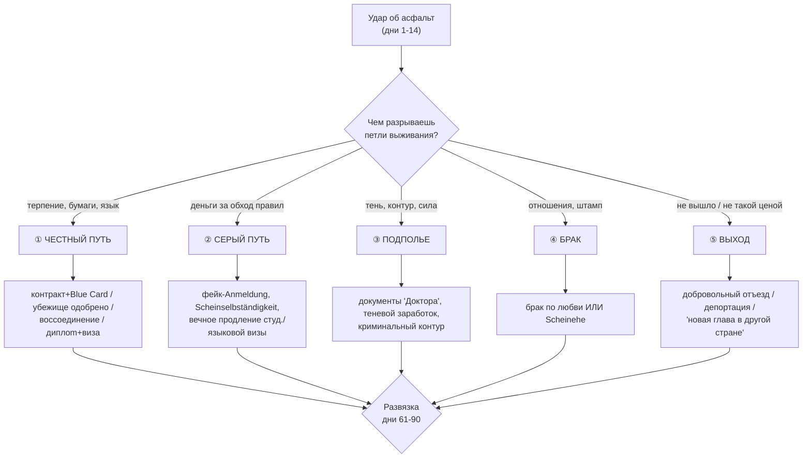
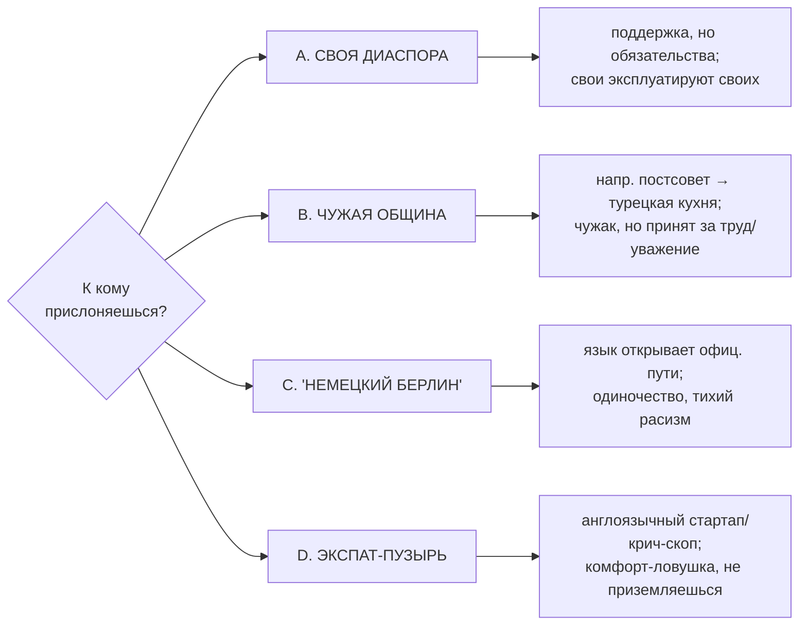
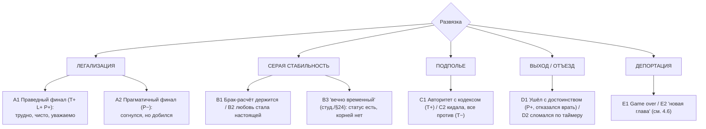

# 04. СЮЖЕТНЫЕ РАЗВИЛКИ

Развилок должно быть много, но не хаотично. Они растут из **четырёх множителей**, которые
перемножаются:

```
БЭКГРАУНД (7)  ×  СТРАТЕГИЯ ЛЕГАЛИЗАЦИИ (5)  ×  ОБЩИННАЯ ОРИЕНТАЦИЯ (4)  ×  АРХЕТИП (≈центр+32)
```

Не все клетки этого произведения уникальны по контенту, но связка из четырёх осей даёт
ощущение, что **твоё прохождение — твоё**. Ниже: хребет (стратегии), общинные ветки, узловые
развилки-«стрелки», концовки и проработанный пример.

---

## 4.1. Хребет: пять стратегий легализации

Это «спинной мозг» сюжета — крупные русла, в которые втекают мелкие выборы. Игрок не выбирает
стратегию кнопкой: она **складывается** из поступков и того, какие двери он открыл/закрыл.



### ① Честный путь (L+ T+)
- **Как:** легальная работа → контракт → ВНЖ/Blue Card; либо доведённое до конца убежище; либо воссоединение «по-белому»; либо диплом → виза выпускника. Язык (Deutsch>50) открывает «немецкий Берлин» и официальные двери.
- **Союзники:** Лена (НКО, бесплатные консультации), Frau Becker (чиновница, которая «узнаёт лицо»).
- **Цена:** медленно; высокий риск провала **не по твоей вине** (термина нет, оффер сорвался, BAMF тянет); требует терпения, которого таймер не даёт.
- **Развилки внутри:** ждать честно vs «честный обход» (лайфхак с отменами терминов в 7 утра); брать работу ниже себя (P−) vs держать марку (P+, риск проесть деньги).

### ② Серый путь (L−слегка, T−)
- **Как:** фейковая Anmeldung, фиктивная самозанятость, бесконечное продление студенческой/языковой визы, «правильно» заполненные бумаги с полуправдой.
- **Союзники:** Али (фиксер, «знает человека»), частично «Доктор».
- **Цена:** деньги; **юридическая хрупкость** (всё держится, пока не проверили); риск шантажа (кто помог — тот держит за горло).
- **Развилки:** разовая серая услуга vs встраивание в серую экономику; платить фиксеру vs самому стать фиксером (G+ A− L−).

### ③ Подполье (L− сильно)
- **Как:** полностью неформальная жизнь, документы «Доктора», теневой заработок, криминальный контур (логистика, серый ритейл, в худшем — наркоэкономика парков).
- **Союзники/проводники:** Виктор (моральный камертон ветки), криминальный контур (находит сам при `L−<−30 & Улица>25`).
- **Цена:** деньги быстрые, но **контур не отпускает**; облавы Zoll, арест, депортация; molva «опасный».
- **Развилки:** разовый риск ради денег vs карьера в контуре; «с кодексом» (T+ L−, уважение) vs кидала (T− A− L−, все против тебя).

### ④ Брак
- **Как:** отношения дают шанс на ВНЖ. **По любви** (Эмилия; или матч внутри общины — ветка «Воссоединение») ИЛИ **Scheinehe** (фиктивный, за деньги/услугу).
- **Цена:** фиктивный брак — серьёзная статья (проверки на «настоящесть», допросы порознь); брак по любви — эмоциональная зависимость статуса от отношений (расстались — рухнул и статус).
- **Развилки:** честно построить отношения (долго, T+) vs «красивая ложь» партнёру (T−, всплывёт); признаться партнёру в расчёте vs тащить двойную игру.

### ⑤ Выход
- **Как:** добровольный отъезд (по таймеру-провалу или как осознанный выбор «не такой ценой»); депортация (провал статуса); «новая глава в другой стране» (см. 4.6).
- **Это не обязательно «проигрыш»:** гордый честный человек, отказавшийся унижаться и врать, и уехавший с достоинством — валидная, сильная концовка.

---

## 4.2. Общинная ориентация (4 русла, ортогональны хребту)

Куда герой «прислоняется» социально — отдельная ось развилок:



- **A. Своя диаспора** — комфорт и спасательный круг (накормят, приютят, скинутся), но связывает: репутация семьи, «будь как все», долги услуг (особенно ветки «Воссоединение», «Беженец»).
- **B. Чужая община** — постсоветский айтишник, прижившийся у турка Мехмета; украинка под крылом сербской сети Виктора. Принимают за труд/надёжность; даёт неожиданные ресурсы.
- **C. «Немецкий Берлин»** — доступен при Deutsch>50; открывает официальные пути и «нормальную» работу; но одиноко и встречаешь тихий, вежливый расизм.
- **D. Экспат-пузырь** — реально для «Соискателя»/«Студента»: англоязычный креатив/стартап-слой. Комфортно, но это **ловушка**: годами «временно», язык не учится, в реальный Берлин так и не входишь.

Ориентаций может быть несколько, и они меняются. Сочетание «хребет × община» даёт фактуру:
честный путь через свою диаспору ≠ честный путь через немецкий Берлин.

---

## 4.3. Узловые развилки-«стрелки» (switch points)

Это ключевые сцены, каждая необратимо перебрасывает игрока между руслами. Каждая — событие
из `05`. Узлы общие для линий, но **условия и реплики варьируются** по бэкграунду/архетипу.

| # | Узел | Когда | Куда разводит |
|---|---|---|---|
| N1 | **Окошко Bürgeramt** (термина нет) | день 2 | честно ждать (①) / давить, скандал (③, AGGRO) / врать про срочность (②/T−) / искать обход (②) |
| N2 | **Первый заработок** (доска у Карима) | день 3 | стройка вчёрную (③/Труд) / мойка у Мехмета (своя/чужая община) / «курьер у Али» (серое) / держать марку, ждать по специальности (P+/①) |
| N3 | **Богдан не доплатил** | после 3 смен | проглотить (P−) / потребовать (P+/AGGRO) / угрожать (③) / к Виктору «решить» (③, долг) |
| N4 | **Знакомство с «Доктором» vs лазейка Лены** | день 6 | серый/тень (②/③) если ходил к Виктору / честная лазейка (①) если ходил к Лене |
| N5 | **Эмилия спрашивает прямо** | 3+ встречи | правда (T+) / красивая ложь (T−, всплывёт у стройки) / уход от ответа (P−) → влияет на ветку ④ |
| N6 | **Облава Zoll на стройке** | 5+ чёрных смен | бежать (Улица) / прятаться / предъявить фальшивку «Доктора» (страшный чек) / сдаться (③→⑤?) |
| N7 | **Предложение Scheinehe** | акт II, если деньги на нуле и L−склонность | согласиться (④-фиктивный) / отказаться (держать ① или ③) |
| N8 | **Зеркало: новоприбывший** | ~день 60 | что ты ему скажешь — итоговое отражение архетипа (влияет на эпилог, не на статус) |
| N9 | **Письмо из Ausländerbehörde** | акт III | финальный чек: всплывает накопленная история TRUTH (враньё из дела) и статус-баллы |

Развилки **не изолированы**: выбор на N1 (соврал чиновнице) лежит в деле и стреляет на N9.
Помощь на N-событии альтруизма возвращается спасением на N6/N9 (если община помнит).

---

## 4.4. Как множители дают «много развилок» (пример комбинаторики)

Один узел N2 «Первый заработок» при разных множителях — разные сцены:

- **Соискатель × ① × немецкий Берлин × `−+−++` (Гордый отшельник):** отказывается от мойки посуды («я инженер»), идёт на собеседования, проедает деньги, но цепляется за специальность. Развилка: согнуться к дню 10 или нет.
- **Заработок × ③ × своя диаспора × `++−−+` (Честный головорез):** идёт к Богдану, сразу пашет, при недоплате (N3) требует своё в лоб — уважение бригады, но конфликт.
- **Беженец × ① × своя диаспора × `−++ +−` (Соль земли):** земляки зовут мыть посуду у «своего», работает за гроши из лояльности, копит слух «помогает», что позже спасёт на N9.
- **Студент × ② × вьетнамская община × `−−−+−` (Приспособленец):** берёт смены в Dong Xuan Center сверх лимита часов (риск визе), всем поддакивает, тихо выживает.

Эта таблица — генератор: исполнитель пишет **вариант события под связку тегов**
(`background`, `strategy_lean`, `community_lean`, `archetype_zone`), а не отдельный сценарий под
каждую комбинацию. Базовый вариант + 2–4 перекраски тегами покрывают большинство клеток.

---

## 4.5. Концовки (таксономия)

Концовку определяет **связка на день 90/событие N9**: `статус × деньги × жильё × ключевые
отношения × профиль`. Не одна метрика. Внутри каждого «русла» тон финала красит **архетип**.



**Эпилог-зеркало (N8) красит любой финал:** что герой сказал новоприбывшему — добрый совет
(A+), циничный урок улицы (Виктор-путь), предупреждение «беги отсюда» (выгорание) или
вербовка в свою схему (T− A−). Это последний кадр, отражающий, кем игрок стал.

**Скрытые/редкие концовки (для реиграбельности):**
- **«Стал Виктором»** — выжил в подполье и сам тянешь новичка в контур (зеркало замкнулось).
- **«Стал Леной»** — легализовался и пошёл волонтёрить, помогать следующим (A+ T+ полный круг).
- **«Тень исчезла»** — архетип `−−−−−`: статуса нет, долгов нет, памяти о тебе нет; уехал в другой город незамеченным. Берлин тебя не запомнил — холодная, но логичная развязка.
- **«Фрау Шмидт»** — ветка чистого альтруизма: помощь без выгоды → у неё пустует Einliegerwohnung, и ей нужен не квартирант, а человек. Жильё+тепло как награда за то, что не считал награды.

## 4.6. Открытый вопрос: депортация = конец или новая глава?

Рекомендация макета (мягкий не-game-over):
- **Депортация/выезд → эпилог + «новая глава»** как короткая кода: герой в другой стране/дома, и текст подводит итог «кем ты стал», ссылаясь на накопленный профиль и ключевые поступки. Это сохраняет вес выбора (ты *проиграл статус*), но не обнуляет 90 дней игрока в «GAME OVER».
- Автосейв без откатов (из v0.1) поддерживает эту философию: последствия необратимы, но история всегда продолжается во что-то осмысленное.

## 4.7. Заметки для реализации

- **Стратегия и община — не флаги-кнопки, а вычисляемые «склонности» (`leanings`)**: counters, растущие от профильных поступков (legal_actions, gray_actions, crime_actions, community_help, cross_community_acts, german_path_acts). Концовка читает их вместе с осями и статусом.
- Узлы N1–N9 — события с высоким приоритетом и жёсткими `entry_conditions` по дню/флагам; их `branches` ставят флаги, которые читаются на N9.
- «Эффект отложенного выстрела» (соврал на N1 → всплыло на N9) реализуется через **записи в деле чиновников** и **слухи** (см. v0.1 §2.4): не спец-флаг под каждый случай, а общий механизм памяти.
- Концовок не нужно «32×7»: достаточно 5 русел × 2–3 тональных варианта, **раскрашенных** эпилогом-зеркалом и 2–3 строками по архетипу. Это даёт десятки ощутимо разных финалов малой ценой.
