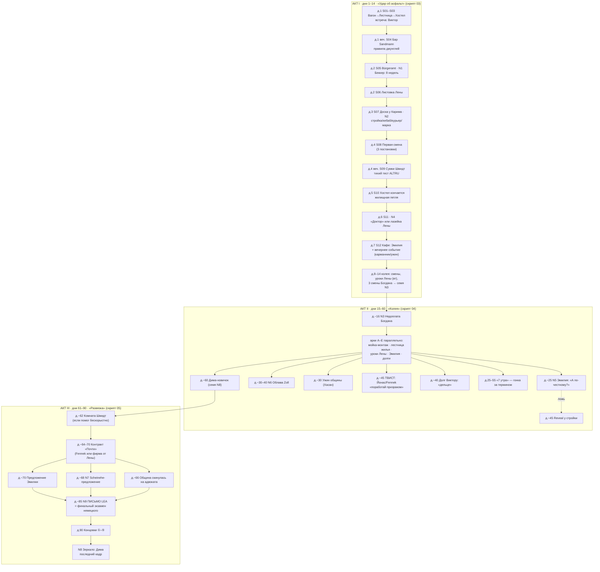
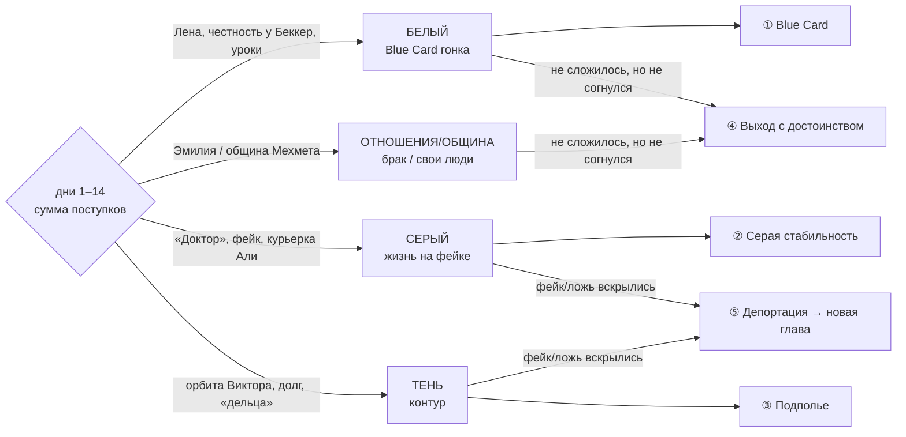

# 01. СЮЖЕТНАЯ ЛИНИЯ ИГРЫ — «Соискатель: 90 дней немецкого»

> **Решение:** игра выпускается с ОДНОЙ магистральной линией — **«Соискатель»**. Остальные 6
> линий (`../02`) остаются в дизайне как расширения, но всё производство (ассеты, анимации,
> сцены, языковой слой) целится в одну историю, доведённую до конца. Ниже — эта история
> целиком: как разворачивается повествование, кто встречается, где, какие развилки, и почему
> она качает немецкий на любом уровне.

## Почему именно «Соискатель»

1. **Каталог Meshy (`../13`) уже отлит под неё.** H01 — «immigrant software developer» — это
   и есть герой линии. Виктор, Мехмет, Шмидт, Богдан, Беккер, Лена, Али, Карим, Эмилия,
   контролёр — 12 из 16 гуманоидов каталога — её каст. Ни один потраченный кредит не пропадает.
2. **Текстовый сюжет уже написан** (`../story/00–05`): три акта, узлы N1–N9, пять концовок,
   диалоги. Этот документ не переписывает его — он **ставит его в 3D** и добавляет два слоя:
   производственный (сцены-сборки-анимации) и языковой (немецкий как геймплей).
3. **Драматургия линии — сама по себе языковая.** Герой без языка в городе-процедуре: каждая
   его сюжетная проблема (термин, работа, жильё, любовь) — это буквально проблема немецкого.
   Учить язык здесь не «мини-игра сбоку», а способ выживания. Идеальный носитель для learning-игры.

---

## Логлайн (хук)

> У тебя 90 дней визы, 1 400 €, чемодан, ноутбук — и немецкий, которого не хватает даже
> на то, чтобы понять, ЧТО именно тебе отвечают в окошке. Оффер, ради которого ты прилетел,
> сгорел за два дня до вылета. Берлин — это процедура, которую нельзя пройти с первого раза,
> и она говорит по-немецки. **Каждое выученное слово — это дверь. Каждая ложь — мина
> замедленного действия. Согнёшься ли ты, не сломавшись?**

Драматический вопрос — ось **PRIDE** (как в `../story/00`). Языковой вопрос, который мы
добавляем: **на каком языке ты будешь выживать?** Русский Виктора — тепло и тупик. Немецкий —
холодно и дверь. Это одна и та же развилка, показанная дважды.

## Что нового относительно текстовой линии (3 добавки)

| Добавка | Что это | Зачем |
|---|---|---|
| **Твист «Fennek»** | Сгоревший оффер получает лицо: стартап Fennek и его CTO Йонас появляются в середине игры (`s_jonas_ghost`, день ~45) и предлагают герою «поработать призраком» — код сейчас, контракт «потом». Schwarzarbeit в IT: та же стройка Богдана, только с латте. | Конкретизирует абстрактного «работодателя» из `s_contract_almost`; замыкает завязку (оффер) на развязку (контракт); сильнейший PRIDE-бит: твоя мечта возвращается в виде той же ловушки. |
| **Языковой слой** | Немецкий NPC — настоящий, градуированный по уровням; непонятое — в «тумане»; слова — лут; уроки Лены — грамматический сериал; письмо LEA — финальный экзамен чтения. Полностью — `02_nemeckiy_sloy.md`. | Игра качает немецкий на любом уровне A0–C1 — не останавливая сюжет. |
| **Кольцо лестницы U-Bahn** | Аэропорта в каталоге нет — и не надо. Игра начинается **подъёмом** по лестнице U-Bahn (E05) с чемоданом и заканчивается (в финале ④/⑤) **спуском** по ней же. Прилёт/вылет — текстовые карточки на чёрном. | Экономит ассеты; даёт игре фирменный визуальный рефрен: «Берлин начинается и заканчивается лестницей». |

---

## КАСТ: кто встречается (маппинг на каталог `../13`)

### Главные (имеют арки)

| Ассет | Персонаж | Роль в линии | Регистр немецкого (см. `02`) | Арка |
|---|---|---|---|---|
| **H01** | Герой (имя задаёт игрок, деф. Алекс), 28 | протагонист | стартует с уровня ИГРОКА | согнуться, не сломавшись |
| **H02** | Виктор, серб, 4 года без статуса | серый наставник, сосед по хостелу | русский + уличный A1 («Alles gut, Bruder») | «я остался — ты?» |
| **H03** | Мехмет, хозяин кебабной | работа-вторая, дверь в общину | тёплый медленный A1–A2 + турецкие вкрапления | «Берлин всех уравнивает» |
| **H04** | Фрау Шмидт, 78 | тихий тест альтруизма → ключ к жилью | B1–B2 с берлинизмами (dit, ooch, wa) | «мне нужен человек, не квартирант» |
| **H05** | Богдан, бригадир | чёрная стройка, узлы N3/N6 | командный A1 (императивы: Komm! Trag! Schneller!) | эксплуататор не-злодей |
| **H06** | Фрау Беккер, чиновница | Bürgeramt, узел N1, лайфхак | Amtsdeutsch B2 — но КЛИШЕ, повторяемые из визита в визит (= учатся) | «система с длинной памятью» |
| **H07** | Лена, волонтёрка НКО | белый путь + УЧИТЕЛЬ немецкого | адаптивный «учительский» немецкий (подстраивается под уровень игрока) | «язык — это двери» |
| **H08** | Али, фиксер | серые гиги, курьерка | краткий точный A2–B1 | «я телефонная книга» |
| **H09** | Карим, шпэти | доска объявлений, барометр молвы | Kiezdeutsch A2 (lan, Digga — со словариком) | хроникёр района |
| **H10** | Эмилия, бариста | любовная ветка, узел N5 | живой быстрый B1+; **при провале понимания переходит на английский — и это охлаждает отношения** | «я вру плохо и чужое враньё чую» |

### Служебные и перекраски (0 кредитов, правило каталога)

| Ассет | Кто из него делается | Где |
|---|---|---|
| **H13** (прохожий М) | «Доктор» (тёмная перекраска), **Йонас/CTO Fennek** (очки-декаль, светлая), Хасан (тёплая), Дима-новичок (молодая, с чемоданом O01), Олег, клерк LEA, маклер | s_doctor_intro, s_jonas_ghost, s_community_dinner, N8, N9 |
| **H14** (прохожая Ж) | толпа, соседка Шмидт, посетительницы | фон |
| **H15** | контролёр BVG ×2, офицеры Zoll ×3 (перекрас в серое, декаль ZOLL) | событие «контроль», N6 |
| **H16** | бригада Богдана ×3 перекраски | стройка |
| **H11, H12** | **в этой линии НЕ используются** (резерв «Беженца»); опционально H11 — камео-гость на ужине общины | — |

---

## ЛОКАЦИИ: какие включены и из чего собираются

Из 27 локаций реестра `../06` в линию входят **15** (в скобках — сборка из каталога):

| Игровая локация (id из `../06`) | Сборка из каталога | Сцены |
|---|---|---|
| `ubahn_car` + `ubahn_station` | E06 вагон; E05 лестница + валидатор-прим. (⚠️ турникетов НЕТ — `../06`) | S01, поездки, финал ④ |
| `street_neukoelln` (песочница-хаб) | E01×3 + E02 (фон) + E03 + E04 + E05 + E24–E30 россыпью + толпа H13/H14 | S02, S09, переходы, reveal |
| `hostel_komet` | комната-бокс: E20×3 + E22 + E21 | S03, S10 |
| `bar_sandmann` | E19 + E18×2 + неон-декали | S04, долг Виктора, Scheinehe, ③ |
| `buergeramt` | E15×2 + E16×3 + табло-декаль | S05, s_becker_recognizes |
| `auslaenderbehoerde` (LEA) | **та же сборка Bürgeramt**: холоднее свет, длиннее коридор (E16×5) | N9 |
| `spaeti_karim` | E03 + интерьер: стеллажи-прим., доска-декаль O15 | S07, молва, N8-вариант |
| `mehmet_kebab` | E04 + E23 + E18×2 + E21 (мойка) | S08, мойка-монтаж, адвокат |
| — задняя комната Мехмета | E18 длинный стол + ковёр-декаль | ужин общины |
| `baustelle` | E12 + E13 + E14 + ограждение-прим. + E30 | S08, N3, N6, reveal |
| `internet_cafe` | E18×3 + E31×4 + декали call-shop | Али, «Доктор», 7 утра |
| `cafe_third_wave` | E17 + E18×3 + растения-прим. | S12, N5, Йонас, предложение |
| `hasenheide_park` | E25×3 + E26×8 + E27×2 | выдохи, свидания, relief-события |
| `overcrowded_flat` (матрас Виктора) | интерьер E02: E22 + матрасы-прим. + сумки (E33×3) | жильё ступень 1 |
| `einliegerwohnung` (Шмидт) | подъезд E01 + интерьер: E21 + E22 + E18 + салфетки/фото-декали | S09 (подъезд), комната Шмидт, «чай в шесть» |

**НЕ входят в линию** (резерв других линий, кредиты на них не тратим в первую очередь):
`refugee_heim` (E10), `mosque_community` (E08), `storefront_church` (E09), `dong_xuan` (E11),
`bamf_office`, `jobcenter`, `russian_shop`, `arbeiterstrich`, `plattenbau_flat` (интерьер),
`altbau_flat` (интерьер), `sonnenallee_market` (E07 — опционально как фон-проходка), `airport_ber`
(заменён «кольцом лестницы»).

---

## КАК РАЗВОРАЧИВАЕТСЯ ПОВЕСТВОВАНИЕ (карта 90 дней)

Сюжетный канон — `../story/00_syuzhet_celikom.md`. Здесь — карта с привязкой к 3D-сценам
скрипта (`03`–`05`) и датами узлов:

### Ритм недели (петли между сюжетными сценами)

Игровой день = утро/день/вечер. Между сценами скрипта живут петли (они же — тренажёр языка):

- **смена** (стройка/мойка/курьерка) → деньги + слова профессии;
- **вторник 18:00 — урок Лены** → грамматика недели (см. `02` §4);
- **шпэти Карима** → молва района (аудирование A2) + доска;
- **вечер** — бар/кафе/парк → социальные петли, события режиссёра давления (`../05`);
- **сон** (O39/O40) → конец дня, тик таймера «до конца визы: N дней».

---

## РАЗВИЛКИ ЛИНИИ (полное дерево)

### Хребет: 4 стратегии → 5 концовок

Первичная развилка складывается ПОСТУПКАМИ Акта I (не кнопкой) — к дню 14 профиль склоняется:

### Узлы-стрелки (где именно ветвится) — сводка

| Узел | День | Сцена (скрипт) | Выбор | Куда стреляет |
|---|---|---|---|---|
| N1 | 2 | S05 Bürgeramt | честно / соврать / давить / взятка / искать обход | заметка в деле → всплывает на N9; лайфхак Беккер откр./закр. |
| N2 | 3 | S07 Доска | стройка / кебаб / курьер / держать марку | профилирует арку работы и склонность |
| — | 4 | S09 Сумки Шмидт | помочь бескорыстно / за благодарность / пройти | **гейт всей арки жилья-по-белому** (Акт III) |
| — | 5 | S10 Хостел | платить дальше / матрас Виктора / белый рынок (стена) | жилищная лестница; долг-связь |
| N4 | 6 | S11 | фейк «Доктора» / лазейка Лены | серый vs белый на всю игру |
| N3 | ~16 | 04-N3 | проглотить / потребовать / угрожать / через Виктора | уважение бригады ↔ **долг Виктору** |
| N5 | ~25 | 04-N5 | правда / красивая ложь / уход / огрызнуться | брак-по-любви ↔ reveal-разрыв |
| N6 | ~30–40 | 04-N6 Облава | бежать / прятаться / предъявить фейк / сдаться | строка в деле → N9; смерть чёрной стройки |
| — | ~45 | 04-JON Йонас | пахать бесплатно / отказ с достоинством / **переговоры по-немецки** / слить и искать через Лену | источник контракта в Акте III + PRIDE |
| — | ~40 | 04-DEBT Долг | услуга / отказ / полу-откуп | контур ↔ холод Виктора |
| N7 | ~68 | 05-SE | Scheinehe: да / нет / разузнать | ② ↔ риск ⑤ |
| — | ~70 | 05-EMP Эмилия | по любви / честный расчёт / соврать / отказаться от брака | тёплый ① / ② / разрыв / ④ |
| N9 | ~85 | 05-N9 Письмо | СВЯЗКА статус×деньги×жильё×отношения×профиль | концовка ①–⑤ |
| N8 | 90 | 05-N8 Зеркало | совет Диме: добрый / циничный / «беги» / вербовка / молчание | красит ЛЮБОЙ финал |

Полные условия связок и скрытые концовки («Стал Виктором», «Стал Леной», «Тень исчезла»,
«Фрау Шмидт») — канон в `../story/04_akt3_sceny.md`, скрипт их не меняет.

### Твист «Fennek» — подробно (новое)

- **Завязка (день 0, титры):** оффер герою давал стартап **Fennek Mobility** («умные самокаты»).
  Инвестраунд лопнул — оффер «заморожен». В Акте I это просто boль в анкете.
- **Встреча (день ~45, кафе Эмилии):** за соседним столиком — ноутбук с лисьим логотипом.
  **Йонас** (CTO, H13-перекраска, IT-Denglisch: «Wir müssen das Feature asap shippen»). Он героя
  по имени не помнит — HR-фильтр резал «без Anmeldung». Неловкость. Потом — «предложение»:
  попилить фичу «по-дружески», оплата и контракт — «когда раунд закроется». **Это Schwarzarbeit
  в твоей собственной профессии** — центральный тезис линии, произнесённый на языке героя.
- **Развилки:** (а) пахать ночами бесплатно — шанс контракта растёт, но время жрёт уроки и смены
  (механика времени, PRIDE −); (б) отказаться с достоинством — Йонас запоминает «профессионала»,
  и на дне ~64, если герой добыл Deutsch>50 или репутацию, Fennek сам возвращается с настоящим
  контрактом («нам нужен тот, кто уже умеет выживать в немецкой бюрократии»); (в) **переговоры
  по-немецки** (языковой гейт B1: провести разговор о letter of intent) — лучший исход:
  бумага о намерениях уже сейчас; (г) послать Fennek и искать через ярмарку Лены — контракт
  безымянной «S-Bahn-подрядчик» фирмы, суше, но надёжно.
- **Схождение:** `s_contract_almost` (Акт III) получает конкретное лицо: контракт приходит от
  Fennek (тёплая ветка) или фирмы Лены (рабочая ветка) — а не от «какого-то работодателя».

---

## ЯЗЫК КАК СЮЖЕТ (столп линии; механика — в `02`)

Три правила, которые делают немецкий несущей конструкцией повествования:

1. **Акт = уровень CEFR.** Акт I выживание = A1 (приветствия, числа, «Ich verstehe nicht»);
   Акт II колея = A2–B1 (работа, рассказ о себе — Perfekt к сцене N5!); Акт III развязка = B2
   (Amtsdeutsch, письмо LEA). Сюжетная кривая и учебная кривая — одна кривая.
2. **NPC = учебник по ролям.** От Мехмета (медленный A1, «Du. Teller. Wasser. Verstehst du?»)
   до Беккер (Amtsdeutsch-клише) и Шмидт (берлинский диалект как эндгейм-аудирование). Игрок
   ЛЮБОГО уровня находит «своего» собеседника — и растёт к следующему.
3. **Финальный босс — письмо.** Кульминация N9 — это лист бумаги на канцелярском немецком.
   Вся игра готовила тебя прочитать его без чужой помощи. (Если община скинулась на адвоката —
   у тебя есть «перевод», это и есть его игровая функция.)

---

## ЧТО СЧИТАЕТСЯ ГОТОВЫМ (definition of done линии)

- [ ] Акт I: 12 сцен скрипта `03` играются в 3D со связкой анимаций P0 (36 клипов, `06` §2.2–2.3).
- [ ] Петли (смена/урок/шпэти/сон) работают между сценами.
- [ ] Акты II–III: узловые сцены `04`–`05` (25 постановок) + событийный пул `../story/05`.
- [ ] Языковой слой `02`: туман, Wortschatz, уроки, письмо-экзамен.
- [ ] Концовки ①–⑤ + зеркало N8.
- [ ] Ни одного ассета вне каталога `../13` + примитивы/декали.

Дальше по пакету: `02_nemeckiy_sloy.md` (язык) → `03`–`05` (скрипт) → `06` (реестры).
