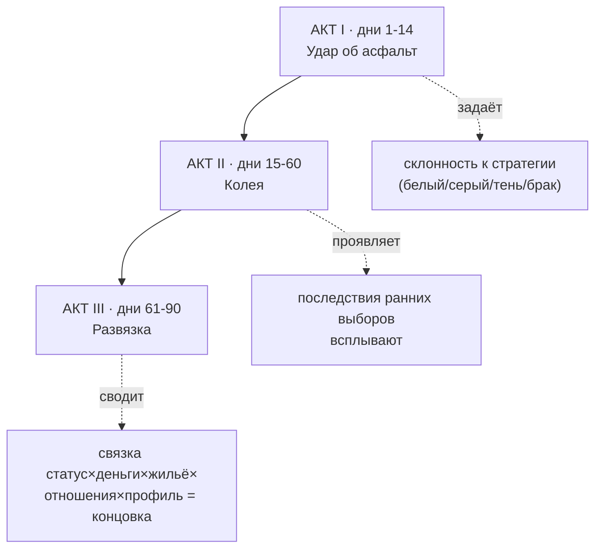
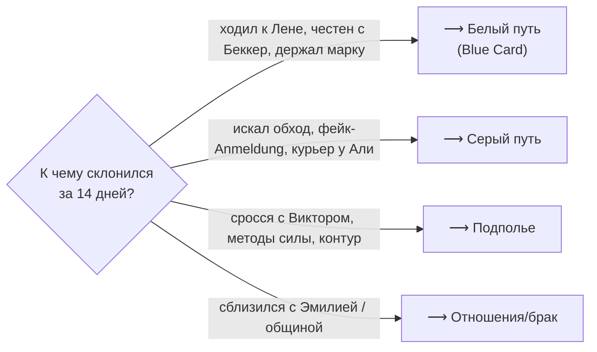
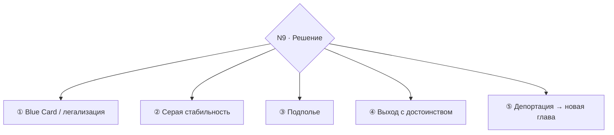

# 00. СЮЖЕТ ЦЕЛИКОМ — «Соискатель»

## Логлайн

Айтишник из постсоветской страны прилетает в Берлин под оффер, который сгорает за два дня до
вылета. У него 90 дней визы, 1 400 €, чемодан и ноутбук. Город — это не место, а процедура,
которую нельзя пройти с первого раза. Чтобы выжить и зацепиться, придётся каждый день решать,
**насколько согнуться, чтобы не сломаться**.

## Драматический вопрос линии

> **Согнёшься ли ты, не сломавшись?**

Стержень — ось **PRIDE**. Сеньор-инженер, которого Берлин пускает быть мойщиком посуды,
курьером, разнорабочим. Каждый узел истории — это микро-выбор между достоинством и выживанием,
между «я не за этим ехал» и «деньги кончились вчера». Побочные стержни: **TRUTH** (соврать
системе сейчас — заплатить позже), **LAW** (быстрый серый путь vs долгий белый), **ALTRU**
(тратить себя на других, когда самому нечего есть).

## Три акта и сквозная история

---

## АКТ I — «Удар об асфальт» (дни 1–14)

**Смысл акта:** узнать правила джунглей и сделать первые выборы, которые мир запомнит. К концу
акта у игрока складывается **склонность к стратегии** (не кнопкой — поступками).

| День | Что происходит | Узел / куда ведёт |
|---|---|---|
| **1** | Прилёт (BER). Хостел «Komet». Туториал через `observe`/`inspect_self`. Сосед **Виктор** (серб, 4 года без статуса). Вечером в баре «Sandmann» Виктор за пивом объясняет: *без Anmeldung ты никто*. | Как ты обошёлся с Виктором → открывает/закрывает серую ветку. `s_arrival`, `s_victor_bar` |
| **2** | **Bürgeramt**: термина нет 8 недель. Окошко **фрау Беккер** — первый настоящий выбор (N1). У входа **Лена** раздаёт листовки НКО. | **N1.** Соврал/давил/ждал честно/искал обход → первая заметка в деле. `s_buergeramt` `s_lena_flyer` |
| **3** | Деньги тают. Доска у **Карима** (шпэти): стройка (**Богдан**, кэш сразу), мойка у **Мехмета** (надо понравиться), «курьер — спросить **Али**» (серое). | **N2.** Первый заработок профилирует. `s_first_job` |
| **4** | Первый рабочий день. Вечером у подъезда **фрау Шмидт** роняет сумки. | Тест ALTRU без обещания награды → семя арки Шмидт. `s_schmidt_bags` |
| **5** | **Хостел кончается.** Виктор: «матрас у знакомых, 200/мес, без вопросов» vs объявления (всем нужен Anmeldung) vs ещё ночь за 35 €. | Жилищная петля схлопывается впервые. `s_hostel_ends` |
| **6** | Письмо: до конца визы 84 дня, для продления нужен контракт. Если ходил к Виктору → знакомство с **«Доктором»** (фейк-Anmeldung 250 €). Если к Лене → честная лазейка (отмены терминов). | **N4.** Развилка стратегий: серый vs белый. `s_doctor_intro` / `s_lena_loophole` |
| **7** | День-выдох: Хазенхайде, бар, **Эмилия** в кафе. Вечером — случайное событие по профилю (у тебя крадут / драка у бара / зовут на ужин общины). | Мир показывает, что уже *запомнил* тебя. `s_emilia_first` + relief/pressure |
| **8–14** | Ритм входит в колею: повторные смены, давление денег, первые отношения. Если 3 смены у Богдана — **недоплата** (N3). Первый урок немецкого у Лены (вторник). | **N3** при 3 сменах. К концу акта склонность к стратегии оформилась. |

**Что куда ведёт по итогам Акта I (главная развилка):**

---

## АКТ II — «Колея» (дни 15–60)

**Смысл акта:** жизнь в выбранной колее; ранние выборы дают **последствия**; характер начинает
открывать/закрывать контент. Пять арок идут параллельно, переплетаясь.

### Арка A — Работа и деньги
- **Стройка (Богдан):** недоплата (N3) → проглотить / потребовать (PRIDE) / угрожать / к Виктору. Дальше — **облава Zoll** (N6) при 5+ чёрных сменах.
- **Кебабная (Мехмет):** заслужил доверие → **ужин общины** → комната в субаренду без Anmeldung. Кросс-интеграция в турецкую общину.
- **Курьер (Али):** серые гиги растут, Али сам рук не пачкает → дрейф к контуру.
- **Дилемма ноутбука:** деньги < 300 € → продать ноут (потеря актива удалёнки) vs держать.
- ⇒ Ведёт к: финансовому состоянию на N9 и к тому, кто ты для мира (надёжный работник / скандалист / «решала»).

### Арка B — Жильё (лестница)
Хостел → матрас у знакомого Виктора → комната через Мехмета (если общинная репутация) → попытка
снять «по-белому» упирается в **стену Schufa/WBS/Anmeldung**. Каждая ступень — деньги/бумаги/связи.
⇒ Ведёт к: наличию адреса для Anmeldung (ключ к белому финалу).

### Арка C — Язык и бюрократия
Урок немецкого у Лены по вторникам → **Deutsch растёт**. На **Deutsch>50** открывается «немецкий
Берлин» (лучшие работы, официальные пути). **Фрау Беккер:** если был честен на Дне 2 и приходишь
честно — она «узнаёт лицо» и сдаёт лайфхак с отменами терминов (честная инвестиция окупается).
⇒ Ведёт к: реальному термину Anmeldung → к белому пути.

### Арка D — Любовь (Эмилия)
Повторные визиты в кафе → **Эмилия спрашивает прямо** (N5): «а чем ты тут вообще занимаешься?».
Правда / красивая ложь / уход. **Ложь работает... до случайной встречи у стройки.** Эмилия —
зеркало: её тепло строго следует твоему профилю и молве.
⇒ Ведёт к: ветке отношений/брака в Акте III (по любви или по расчёту).

### Арка E — Долги и совесть
- Если решал вопрос с Богданом «через Виктора» — **долг Виктору** возвращается услугой, от которой не отказаться.
- Фейк-Anmeldung «Доктора» работает... **обычно**. Если сорвётся в неподходящий момент → катастрофа в Акте III.
⇒ Ведёт к: рискам на N6/N9; к выбору «контур не отпускает».

### Семя зеркала (~день 60)
Игра сводит тебя с **новоприбывшим** иммигрантом — теперь *ты* в роли Виктора (N8).
⇒ Ведёт к: финальному кадру-эпилогу в Акте III.

**Что куда ведёт по итогам Акта II:** к дню 60 у игрока есть (или нет): адрес/Anmeldung, контракт
или его перспектива, отношения, долги, репутация и история честности в деле. Это входные данные
развязки.

---

## АКТ III — «Развязка» (дни 61–90)

**Смысл акта:** таймер визы жмёт, все нити сходятся в один узел.

### Схождение
- **Белый путь:** контракт почти есть (Blue Card §18b), но не хватает **Anmeldung** → гонка за термином (лайфхак Беккер) или... соблазн фейка.
- **«Доктор»** предлагает фальшивку в последний момент (быстро, но N9 может это вскрыть).
- **Община** скидывается на адвоката, если ALTRU+ и слух «помогает».
- **Эмилия** может предложить брак (по любви? по расчёту? — следствие N5).
- **Письмо из Ausländerbehörde** (N9): всплывает накопленная история TRUTH (вранья из дела).

### N9 — Решение
Кульминация. Резолв читает связку: **статус-баллы × деньги × жильё × ключевые отношения ×
профиль**. Не одна метрика. Тон финала красит архетип (`../03`).

### Концовки (конкретно для линии)

1. **Blue Card / легализация** *(T+ L+, контракт + честно/лайфхаком решённый Anmeldung).*
   «Чисто, но трудно». Виктор: «Ну ты и упрямый, браток. Уважаю.» Лена: тихо рада. Эмилия — если
   честен — рядом по-настоящему.
2. **Серая стабильность** *(держится фейк-Anmeldung / Scheinselbständigkeit / брак-расчёт).* Статус
   есть, фундамента нет. Живёшь, оглядываясь. Вариант: брак с Эмилией «стал настоящим» (теплее) или
   остался сделкой (холоднее).
3. **Подполье** *(сросся с контуром).* Деньги и свобода ценой вечного риска. Виктор-путь замкнулся:
   ты теперь сам кого-то тянешь в тень.
4. **Выход с достоинством** *(P+ отказался врать/унижаться, уехал).* Не поражение — выбор «не такой
   ценой». Сильный, горький финал.
5. **Депортация → новая глава** *(виза истекла / поймали на фейке на N9).* Не «GAME OVER»: короткая
   кода в другой стране/дома, подводящая итог — кем ты стал.

### N8 — Эпилог-зеркало (красит любой финал)
Что ты сказал новоприбывшему:
- добрый совет (A+) → «Держись людей. Не все тут волки.»
- циничный урок (Виктор-путь) → «Правило одно: у всего есть цена. Усвой — выживешь.»
- «беги отсюда» (выгорание) → «Пока не поздно — возвращайся. Это не стоит того.»
- вербовка в схему (T− A−) → «Хочешь заработать? Есть тема. Слушай сюда...»

Это последний кадр — отражение того, кем игрок стал за 90 дней.

---

## Карта «что куда ведёт» (узлы и их выстрелы)

| Узел | Сцена | Выбор → последствие (где стреляет) |
|---|---|---|
| **N1** | `s_buergeramt` (д.2) | соврал про срочность → 🏷 заметка в деле → всплывает на **N9** |
| **N2** | `s_first_job` (д.3) | стройка/кебаб/курьер/держать марку → задаёт арку A и склонность |
| **N3** | `s_bogdan_underpaid` (Акт II) | «через Виктора» → 🏷 долг → возврат услугой в Арке E |
| **N4** | `s_doctor_intro`/`s_lena_loophole` (д.6) | серый vs белый → ветвит стратегию на весь Акт II–III |
| **N5** | `s_emilia_asks` (Акт II) | ложь → всплывает у стройки → бьёт по ветке брака на **N9** |
| **N6** | `s_zoll_raid` (Акт II) | фейк-документ на облаве → страшный чек → арест/бегство |
| **N7** | `s_scheinehe_offer` (Акт II–III) | фиктивный брак → серая концовка ② |
| **N8** | `s_newcomer_mirror` (д.~60) | реплика новичку → красит эпилог |
| **N9** | `s_letter_lea` (Акт III) | связка всего → выбор концовки ①–⑤ |

## Отложенные выстрелы (ранний выбор → поздняя расплата/награда)

- Соврал Беккер (д.2) → на N9 в деле нестыковка → минус к белому финалу. **Был честен** → Беккер сдаёт лайфхак с термином → плюс к белому.
- Помог фрау Шмидт (д.4), не ожидая награды → в Акте III у неё **пустует Einliegerwohnung**, и решается твоё жильё (ключ к Anmeldung). Награда за то, что не считал награду.
- Заслужил Мехмета (Акт II) → община **скидывается на адвоката** на N9.
- Соврал Эмилии (N5) → встреча у стройки → разрыв → ветка брака закрыта.
- Брал фейки у «Доктора» → один срабатывает на N6/N9 неудачно → катастрофа.

## ↪ Перекраски для других линий (кратко)

- **Беженец:** «контракт» → «решение BAMF»; N1 у окошка → Anhörung; Виктор → Самира (история для собеседования); драм-вопрос смещается с PRIDE на **TRUTH**.
- **Заработок:** виза не тикает, тикают **долг и тело**; Богдан → Януш; стержень — PRIDE+AGGRO (требовать своё) и эксплуатация «своими».
- **Студент:** двойной таймер (Sperrkonto + учёба); Dong Xuan вместо стройки; стержень — изоляция и «не подвести родителей».
- Остальные — по `../02` и `../04`.

Полные сцены — в `02_akt1_sceny.md`, `03_akt2_sceny.md`, `04_akt3_sceny.md`. Персонажи и их
диалоги — в `01_personazhi_golosa.md`. События в YAML — в `05_event_pool.md`.
