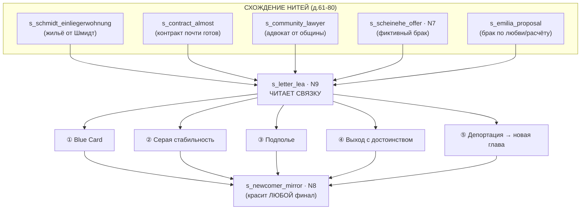

# 04. АКТ III — СЦЕНЫ (дни 61–90)

«Развязка». Таймер визы жмёт, все нити Актов I–II сходятся в один узел. Формат — см.
[`README.md`](README.md). Каждая сцена читается как сценарий и ложится в схему события
[`../05`](../05_sistema_sobytiy.md).

Δ = подсказки осей · 🏷 = слух/заметка в деле · 🎲 = скилл-чек · ⇒ ВЕДЁТ К = куда перебрасывает ·
↪ перекраска = как переигрывается для другой линии · **Nx** — узел из [`../04`](../04_razvilki.md).

> **Главный закон Акта III:** концовку определяет **СВЯЗКА** — `статус-баллы × деньги × жильё ×
> ключевые отношения × профиль (история TRUTH из дела)`. Не одна цифра. Тон финала **красит
> архетип** ([`../03`](../03_osi_i_arhetipy.md)) — одна и та же концовка ① у «Тихого праведника»
> `−++++` и у «Расчётливого дельца» `++−−−` звучит по-разному. Интенты — только из закрытого
> словаря v0.1 (28 глаголов).

> **Зависимость от Акта II:** файл `03_akt2_sceny.md` ещё не написан, поэтому ниже флаги Акта II
> берутся из раздела «АКТ II» в [`00_syuzhet_celikom.md`](00_syuzhet_celikom.md) и узлов N3/N5/N6
> в [`../04`](../04_razvilki.md). Ключевые входные флаги: `белый_путь_активен`, `имеет_фейк_anmeldung`,
> `помог_Шмидт_бескорыстно`, `заслужил_Мехмета`, `долг_Виктору`, `соврал_Беккер` (N1),
> `соврал_Эмилии` (N5) / `разрыв_с_Эмилией`, `был_честен_на_N5`, `пережил_облаву` (N6),
> склонности `leaning.{legal,gray,crime}`, оси, деньги, наличие адреса/Anmeldung.

---

## КАРТА АКТА III (как сцены сходятся в концовку)

---

# ЧАСТЬ A. СХОЖДЕНИЕ НИТЕЙ (дни 61–80)

---

### СЦЕНА s_schmidt_einliegerwohnung — «Комната наверху»  (день ~62, einliegerwohnung)
Вход: флаг **"помог_Шмидт_бескорыстно"** (из `s_schmidt_bags`, д.4) И день ≥ 60.
**Если флага нет — сцена НЕ запускается** (фрау Шмидт просто здоровается на лестнице, дверь её
жизни закрыта; путь к жилью через неё недоступен — это и есть цена того, что в Акте I считали выгоду).
Факты сцены (вне списка выдумывать нельзя):
  - Фрау Шмидт, 78. У неё наверху пустует **Einliegerwohnung** (пристройка-квартирка), мужнина.
  - Жильё с настоящим адресом = легальный адрес → возможность **Anmeldung** → ключ к ① Blue Card.
  - Денег она не просит. Ей нужно живое тепло, а не квартирант.
  - Это самая тихая награда игры — приходит к тому, кто не считал выгоду (`../04` 4.5, «Фрау Шмидт»).
Завязка: ты заносишь ей почту (или просто здороваешься на лестнице). Она дольше обычного смотрит,
потом — против своего обыкновения — приглашает войти. Чай. Долгая пауза. Она показывает наверх.

ФРАУ ШМИДТ *(сухо, глядя в окно, не на тебя)*: «У меня наверху пустует комната. Einliegerwohnung. Мужу была... *(пауза)* Мне не нужен квартирант, junger Mann. Мне нужен... человек. Который не смотрит в телефон.»

▷ ИГРОК → `ask_help` honesty:truthful (честно сказать, что тебе нужен адрес для Anmeldung — не скрывать нужду):
    Она кивает — она и так знала. «So. Адрес вы получите. Это всё равно мой адрес — пусть будет и ваш. Только... иногда пейте со мной чай. Это не плата. Это просьба.» Подписывает Wohnungsgeberbestätigung своей рукой.
    Δ ALTRU +2, TRUTH +2 · 🏷 — (она не сплетница) · флаг **"есть_адрес"**, **"живёт_у_Шмидт"**
    ⇒ ВЕДЁТ К: `s_contract_almost` (теперь Anmeldung достижим честно) → сильнейший плюс к **① Blue Card**.
▷ ИГРОК → `offer_help` method:labor (принять, но в ответ предложить помогать ей — починить, носить продукты):
    Почти улыбка. «Na also. Договорились. Но без жалости, junger Mann. Я ещё не музейный экспонат.»
    Δ ALTRU +3 · флаг **"есть_адрес"**, **"живёт_у_Шмидт"**, **"забота_о_Шмидт"** (теплейшая краска финала)
    ⇒ ВЕДЁТ К: `s_contract_almost`; на N9 — отражение «человек, который остался человеком».
▷ ИГРОК → `trade`/`bribe` (предложить ей деньги за комнату, «как положено, по рынку»):
    Холодеет на градус — но не закрывает дверь (ты её заслужил в Акте I). «Деньги. *(качает головой)* Я же сказала. Не за этим. *(пауза)* Ладно. Берите комнату. Деньги оставьте себе — они вам нужнее. Только не делайте вид, что это сделка. Мне это... оскорбительно.»
    Δ ALTRU +1, PRIDE +1 · флаг **"есть_адрес"** (жильё всё равно твоё), но НЕ «забота_о_Шмидт»
    ⇒ ВЕДЁТ К: `s_contract_almost`; жильё решено, но самой тёплой краски финала не будет.
▷ ИГРОК → `refuse` polite (отказаться — гордость, «не могу принять такое даром»):
    «[de] Stolz. *(Гордость.)* *(долго смотрит)* Я понимаю гордость лучше многих. *(пауза)* Комната всё равно ваша, когда передумаете. Старики умеют ждать.» Дверь остаётся приоткрытой ещё несколько дней.
    Δ PRIDE +3, ALTRU +1 · флаг **"Шмидт_предложила_жильё"** (можешь вернуться позже)
    ⇒ ВЕДЁТ К: если позже примешь — `s_contract_almost`; если так и не примешь — путь к жилью закрыт, выше риск ④/⑤.

↪ перекраска (Война): вместо Шмидт — пожилая немка из волонтёрского чата (типаж Шмидт), у которой
комната после уехавших; та же тихая механика «не квартирант, а человек».
↪ перекраска (Невидимка): эта дверь почти всегда закрыта — у «Невидимки» нет легального адреса в
принципе; альтруизм возвращается иначе (церковь укрывает, но без Anmeldung).

Выход: жильё (и легальный адрес) решены тихой наградой за бескорыстие → к гонке за Anmeldung.

---

### СЦЕНА s_contract_almost — «Почти»  (день ~64–70, cafe_third_wave / по телефону)
Вход: флаг **"белый_путь_активен"** (N4-белый) И один из: достаточная репутация работника (Мехмет/
легальная работа) ИЛИ Deutsch>50 ИЛИ помощь Лены по Blue Card.
Факты сцены:
  - Работодатель готов дать контракт под **Blue Card §18b** (зарплата выше порога, твоя специальность).
  - Контракт почти готов — **не хватает Anmeldung** (адреса для регистрации). Замкнутый круг (`../08` 8.3).
  - До конца визы — считанные недели. Окно термина — узкое.
  - Если есть **"есть_адрес"** (через Шмидт/Мехмета) → Anmeldung реально получить.
  - Если адреса нет → выбор: гонка за термином (лайфхак Беккер) ИЛИ соблазн фейка «Доктора».
Завязка: письмо/звонок: «Wir würden Sie gerne einstellen — нам нужна только ваша регистрация по
адресу.» Так близко, что зубы сводит. Ты смотришь на дату окончания визы.

ЛЕНА *(если ведёт тебя)*: «Контракт есть. Это огромно. *(пауза)* Осталась одна бумажка — Anmeldung. Я знаю, звучит как издёвка: вы прошли всё, и упёрлись в строчку. Но это последняя строчка. Давайте её закроем.»

▷ ИГРОК → `apply` method:online + `book_appointment` (гонка за термином, лайфхак Беккер «в 7 утра отменяют») — *требует флага был_честен_у_Беккер*:
    🎲 Бюрократия + настойчивость (мини-игра отмен): успех → термин в окно визы → Anmeldung → контракт подписан.
    Беккер, увидев твоё лицо: «Послушайте. Официально термина нет. *(тихо, оглядываясь)* Но если зайти на сайт в семь утра — иногда отменяют. Попробуйте. Только это я вам не говорила.»
    Δ LAW +2, TRUTH +1, PRIDE +1 · 🏷 дело: «прошёл всё честно, в срок» (огромный плюс на N9) · флаг **"anmeldung_честно"**, **"контракт_подписан"**
    ⇒ ВЕДЁТ К: чистейший путь к **① Blue Card** («A1 Праведный финал»).
▷ ИГРОК → `submit_docs` method:genuine (если есть **"есть_адрес"** от Шмидт/Мехмета — подать с настоящей Wohnungsgeberbestätigung):
    Спокойно, без гонки. Anmeldung оформляется по-белому. Контракт подписан.
    Δ LAW +2, TRUTH +1 · 🏷 дело: «адрес подтверждён, всё чисто» · флаг **"anmeldung_честно"**, **"контракт_подписан"**
    ⇒ ВЕДЁТ К: **① Blue Card** — путь через тихую награду Шмидт/общину.
▷ ИГРОК → `submit_docs` method:forged (сорваться в последний момент — взять фейк-Anmeldung у «Доктора», чтобы успеть):
    «ДОКТОР»: «Настоящий бланк, настоящая печать. Адрес... существует. 250. Вперёд. Гарантий нет — есть вероятность.» Контракт подписывают на фейк-адрес. Статус как бы есть.
    Δ LAW −6, TRUTH −4 · 🏷 — (тихо) · флаг **"имеет_фейк_anmeldung"**, **"контракт_на_фейк"**
    ⇒ ВЕДЁТ К: **② Серая стабильность** (если фейк выдержит N9) ИЛИ **⑤ Депортация** (если вскроется) — отложенная мина.
    ↯ ОТЛОЖЕННЫЙ ВЫСТРЕЛ: на N9 LEA сверяет адрес. Если **соврал_Беккер** на N1 — нестыковка усиливается.
▷ ИГРОК → `refuse`/`rest` idle (сдаться: «не успеть, всё зря») — пассивный путь:
    Окно термина закрывается. Виза дотлевает. Контракт повисает без регистрации.
    Δ PRIDE −1 · флаг **"окно_упущено"**
    ⇒ ВЕДЁТ К: дрейф к **⑤ Депортация** или (если есть деньги/Эмилия) к ② через брак.

↪ перекраска (Беженец): «контракт» → «положительное решение BAMF»; гонка за термином → ожидание
письма после Anhörung; «фейк» → «подправленная история» (бьёт TRUTH сильнее, чем LAW).
↪ перекраска (Студент): нужен не Anmeldung, а продление по прогрессу + Sperrkonto; «фейк» → липовая
справка о посещаемости.

Выход: либо контракт закрыт по-белому (мощный задел на ①), либо повис, либо подпёрт фейком (мина к N9).

---

### СЦЕНА s_community_lawyer — «Скинулись»  (день ~66, mosque_community / mehmet_kebab)
Вход: **"заслужил_Мехмета"** (ужин общины, Акт II) И (`ALTRU` высокий ИЛИ слух «помогает» ИЛИ доверие
Мехмета). Отложенная награда за доброту (`../04` 4.5; `../03` 3.5: «A+ & слух "помогает" → община скидывается»).
Факты сцены:
  - Турецкая община узнала, что у тебя «дело» (виза, статус). Скинулись на **адвоката по миграции**.
  - Адвокат — реальный рычаг на N9: правильно поданное заявление, обжалование, сопровождение.
  - Это не сделка. Это «evladım, ты свой».
Завязка: Мехмет зовёт в подсобку. На столе — конверт. Рядом — пара мужчин из общины, кивают.

МЕХМЕТ *(кладёт руку на конверт)*: «Тут немного. Но тут — от каждого по чуть-чуть. На адвоката, evladım. Хорошего, не из тех, что обдирают. *(тише)* Ты для нас работал честно. Помогал. Этот город забывает таких. Мы — нет. Yavaş yavaş, но мы своих не бросаем.»

▷ ИГРОК → `apologize`/`talk` honesty:truthful (принять с благодарностью, без лишних слов, по-мужски):
    Мехмет доволен. «Bak (вот). Так и надо. Не благодари. Когда-нибудь скинешься сам — за другого. Это и есть проценты.»
    Δ ALTRU +2, PRIDE +1 · 🏷 «свой у турок» (turkish, сильный) · флаг **"есть_адвокат"**, **"долг_доброты_общине"**
    ⇒ ВЕДЁТ К: на N9 адвокат сглаживает нестыковки, тянет к **① Blue Card** даже при шероховатостях дела.
▷ ИГРОК → `offer_help` (принять и тут же пообещать отработать общине — переводы, помощь новичкам):
    «[tr] Maşallah. *(Молодец.)* Видишь, abi: ты уже думаешь как мы. Иди. И выиграй своё дело.»
    Δ ALTRU +3 · флаг **"есть_адвокат"**, семя скрытой концовки **«Стал Леной»** (если потом волонтёришь)
    ⇒ ВЕДЁТ К: **① Blue Card**; краска эпилога — добрый совет новичку (A+).
▷ ИГРОК → `refuse` polite (P+, «не могу брать у вас деньги, я сам»):
    Мехмет не обижается, но качает головой. «Гордость. *(вздыхает)* Гордость в карман, evladım — её не съешь, я тебе это в первый день сказал. *(пауза)* Конверт полежит. Передумаешь — он твой.»
    Δ PRIDE +3, ALTRU +1 · флаг **"община_предложила_адвоката"** (можно вернуться)
    ⇒ ВЕДЁТ К: без адвоката N9 жёстче; но краска «гордого покровителя» (`../03` пара 9, `A+ & P+`).
▷ ИГРОК → `trade` (взять, но настоять, что вернёшь с процентом, «как заём»):
    Мехмет мрачнеет, как от «сразу про деньги». «Это не банк, abi. У нас так не принято. Хочешь — верни добром. Деньгами — обидишь.» Берёт назад половину разговора.
    Δ ALTRU 0, PRIDE +1 · флаг **"есть_адвокат"**, но НЕ «долг_доброты_общине» (теплоты меньше)
    ⇒ ВЕДЁТ К: адвокат есть, но община держит тебя на дистанции «расчётливого».

↪ перекраска (Беженец): арабская община/мечеть скидывается на адвоката для Anhörung; ещё теплее, но
и обязательств больше («правильная история», лояльность).
↪ перекраска (Невидимка): пятидесятническая церковь-в-магазине молится и собирает на адвоката —
безусловная солидарность даже без статуса.

Выход: на N9 у тебя есть (или нет) адвокат — рычаг, который читается в финальной связке.

---

### СЦЕНА s_scheinehe_offer — «Назовём это браком»  (день ~68, bar_sandmann / internet_cafe, **N7**)
Вход: деньги ≈ 0 (или критично мало) И склонность к серому (`leaning.gray>0` ИЛИ `LAW` в минусе) И
**НЕТ** живой романтической ветки по любви (если жива — см. `s_emilia_proposal`).
Факты сцены:
  - Через Виктора/Олега/Али выходят на предложение **фиктивного брака** (Scheinehe): штамп → ВНЖ.
  - Цена: деньги вперёд + риск (проверки на «настоящесть», допросы порознь — `../04` 4.1 ④).
  - Это серый/брачный путь, не любовь. «Бизнес.»
Завязка: Виктор (или Олег) подсаживается: есть «вариант». Женщина (или мужчина) с паспортом, которой
тоже нужны деньги. Всё «по-взрослому».

ВИКТОР *(понизив голос)*: «Слушай сюда, браток. Денег нет, виза тлеет. Есть тема. Брак. Не любовь — бумага. Штамп — и ты человек. Стоит денег и нервов. Но работает. *(пауза)* Только это уже совсем другая игра. Поймают на "ненастоящем" — это статья. Думай.»
ОЛЕГ *(если он — твой контакт)*: «Двадцать процентов мне, остальное ей. Братан, ну ты чё, по очередям ходишь? Несовременно. Штамп — и ты легальный. Чисто бизнес.»

▷ ИГРОК → `trade`/`apply` props:{type: marriage} (согласиться на Scheinehe):
    Договор, деньги, репетиция «легенды» (как познакомились, что любит на завтрак). Холодная сделка.
    Δ LAW −5, TRUTH −4, PRIDE −2 · 🏷 «вошёл в схему» (gray) · флаг **"scheinehe_активен"**, **"долг_Виктору/Олегу"**
    ⇒ ВЕДЁТ К: **② Серая стабильность** (брак-расчёт; статус есть, фундамента нет). На N9 — проверка «настоящести».
    ↯ ВЫСТРЕЛ: если на N9 допросы порознь не сойдутся / адрес-фейк всплывёт → риск ⑤.
▷ ИГРОК → `refuse` firm (отказаться, держать ① / уйти в ④):
    Виктор пожимает плечами: «Ну-ну. Гордый. *(без злобы)* Я предложил — ты услышал. Дверь не закрываю. Город сам тебя дожмёт или не дожмёт.»
    Δ PRIDE +3, LAW +1, TRUTH +1 · флаг **"отказался_от_scheinehe"**
    ⇒ ВЕДЁТ К: остаёшься на **①** (если контракт жив) ИЛИ дрейф к **④ Выход с достоинством**.
▷ ИГРОК → `inquire_status`/`talk` (расспросить про риски, но не решать):
    Виктор честен о цене (он всегда честен о цене): «Допросы. По отдельности спросят, какого цвета у неё зубная щётка. Не сойдётесь — оба попадаете. Вот тебе вся правда. Дальше сам.»
    Δ — · флаг **"знает_про_scheinehe"** (опция остаётся открытой до N9)
    ⇒ ВЕДЁТ К: решение отложено к развязке.
▷ ИГРОК → `befriend`/`talk` honesty:truthful (если предлагает Олег — а ты знаешь от Марины «от этого подальше»):
    Можешь отказать со ссылкой на репутацию Олега. Марина была права: «Хороший парень был. Был.»
    Δ TRUTH +1, LAW +1 · 🏷 «не повёлся на Олега» (slavic)
    ⇒ ВЕДЁТ К: закрыл серую дверь Олега; держишь курс на ①/④.

↪ перекраска (Заработок): Scheinehe ради ВНЖ менее логичен (виза не тикает) — вместо него
Scheinselbständigkeit (фиктивная самозанятость) как «серая стабильность».
↪ перекраска (Война): §24 даёт статус без брака — N7 почти не возникает; если возникает, то как
способ «закрепиться навсегда», а не выжить.

Выход: брачно-серая дверь открыта/закрыта; на N9 её последствия читаются в связке.

---

### СЦЕНА s_emilia_proposal — «По-честному или по расчёту»  (день ~70, cafe_third_wave / altbau_flat)
Вход: ветка Эмилии **жива** — флаг **"был_честен_на_N5"** (на N5 сказал правду). Отношения тёплые.
**Если на N5 соврал → флаг "разрыв_с_Эмилией" → этой сцены НЕТ** (она ушла у стройки; «Кофе за счёт
заведения. Прощай.»). Пометка: тогда вместо неё доступен только холодный `s_scheinehe_offer`.
Факты сцены:
  - Эмилия знает, кто ты и что ты (мойщик/курьер/инженер-без-статуса) — и осталась.
  - Тема брака всплывает честно: между вами это уже всерьёз. Но рядом — твоя виза, и она это видит.
  - Развилка: брак **по любви** (тёплый ① или «② стало настоящим») vs предложить ей **расчёт**
    (холодный Scheinehe — даже с любимым человеком можно превратить чувство в сделку).
Завязка: вечер. Эмилия кладёт ладонь поверх твоей. «Я навела справки. Знаешь, что брак решает твою
визу? *(пауза, прямо смотрит)* Я не хочу, чтобы ты женился на мне из-за штампа. И не хочу потерять
тебя из-за штампа. Скажи как есть. По-честному. Я вру плохо и чужое враньё чую.»

▷ ИГРОК → `flirt`/`talk` honesty:truthful (по любви — честно: «дело не в визе, дело в тебе»):
    Она выдыхает. «Honest. *(улыбается)* Я знала. Ладно. Тогда не из-за визы. Из-за нас. А виза... пусть будет приятным побочным эффектом.» Брак по любви — и статус как следствие, не как цель.
    Δ TRUTH +3, ALTRU +1, PRIDE +1 · флаг **"брак_по_любви"**, **"есть_адрес"** (её квартира), путь к Anmeldung
    ⇒ ВЕДЁТ К: **① Blue Card** через брак-по-любви (тёплый ①) ИЛИ **②** «стало настоящим» (если статус серый).
▷ ИГРОК → `talk` honesty:truthful, но честно о расчёте («давай по-честному: мне нужен статус, тебе — решай сама»):
    Она долго молчит. «Спасибо, что не соврал. *(тихо)* Это... не романтично. Но честно. Дай подумать.» Если согласится — брак-сделка, но **без лжи между вами** → теплее, чем чужой Scheinehe.
    Δ TRUTH +2, PRIDE −1 · флаг **"брак_расчёт_честный"**
    ⇒ ВЕДЁТ К: **② Серая стабильность**, вариант «честная сделка» (может потеплеть до настоящего).
▷ ИГРОК → `deceive` honesty:lie (соврать ей в лицо ещё раз — «конечно по любви», думая о штампе):
    🎲 Эмилия чует фальшь (её ось TRUTH +25). Высокий шанс провала. Провал → «Я же говорила. Чужое враньё чую. *(встаёт)* Не так. Не со мной.» — разрыв здесь и сейчас.
    Δ TRUTH −5 · 🏷 «соврал близкому» · флаг **"разрыв_с_Эмилией"**
    ⇒ ВЕДЁТ К: ветка брака закрыта; дрейф к ②(чужой Scheinehe)/④/⑤. Отложенный выстрел сработал.
▷ ИГРОК → `refuse` polite (отказаться от брака вообще — «не хочу привязывать тебя к своей беде», P+):
    «[de] Du bist ein Idiot. *(Ты идиот.)* *(грустно улыбается)* Благородный идиот. Ладно. Тогда мы просто... посмотрим, что будет. Без штампа.» Отношения живы, но статус ты ищешь сам.
    Δ PRIDE +3, ALTRU +2 · флаг **"отношения_без_брака"**
    ⇒ ВЕДЁТ К: если статус решишь иначе — тёплый **①**; если нет — горький, но достойный **④** (она ждёт «снаружи»).

↪ перекраска (Воссоединение/община): вместо Эмилии — матч внутри общины; «расчёт vs любовь» острее
из-за репутации семьи и давления «быть как все».

Выход: ветка брака разрешается — по любви, по честному расчёту, разрывом или достоинством. Всё читается на N9.

---

# ЧАСТЬ B. КУЛЬМИНАЦИЯ — N9

---

### СЦЕНА s_letter_lea — «Письмо»  (день ~85, auslaenderbehoerde, **N9**)
Вход: день ≥ 84 (виза на исходе). Высший приоритет — это резолв-узел всей линии.
Факты сцены:
  - Письмо из **Ausländerbehörde** (LEA). Решение по твоему статусу. Конверт в руках.
  - LEA — одна фракция с Bürgeramt (`01`, Беккер): **дело у них общее, память длинная**.
  - Резолвер ЧИТАЕТ СВЯЗКУ: `статус-баллы × деньги × жильё × ключевые отношения × профиль (TRUTH-история)`.
  - **Отложенные выстрелы Актов I–II всплывают тут** (механизм памяти, `../04` 4.7):
    · соврал Беккер на N1 (🏷 «пытался ввести в заблуждение») → **нестыковка в деле** → минус к белому;
    · покупал фейки у «Доктора» (`имеет_фейк_anmeldung` / `контракт_на_фейк`) → адрес сверяют → может вскрыться;
    · был честен у Беккер → 🏷 «прошёл всё честно» → плюс; адвокат общины → сглаживает шероховатости;
    · Scheinehe → проверка «настоящести» (допросы порознь).
Завязка: ты вскрываешь конверт (или сидишь в коридоре LEA, длиннее и мрачнее, чем Bürgeramt). Чиновник
поднимает глаза от твоего дела — толстой папки, в которой записано всё, что ты делал 90 дней.

ЧИНОВНИК LEA *(листает дело, нейтрально, по-беккеровски устало)*: «[de] So. Ihre Akte. *(Ваше дело.)* *(читает)* Hier steht einiges. *(Тут много чего записано.)*»

> **Как связка ведёт к концовкам (резолвер читает состояние, не одну цифру):**

▷ СВЯЗКА → **контракт_подписан + anmeldung_честно + (TRUTH≥0, дело чистое) + жильё (Шмидт/Мехмет/Эмилия)**:
    Дело сходится. Адрес настоящий, история честная, контракт реальный. Печать.
    🎲 если был честен у Беккер → бонус; если адвокат общины → страховка от мелких придирок.
    ⇒ ВЕДЁТ К: **КОНЦОВКА ① Blue Card / легализация** (`s_end_bluecard`).
▷ СВЯЗКА → **статус есть, но через фейк/Scheinselbständigkeit/брак-расчёт; дело шероховатое, но не вскрыто**:
    Чиновник щурится на адрес, но проверка не доходит до дна (фейк выдержал / брак «достаточно настоящий»).
    «[de] In Ordnung. Vorerst. *(В порядке. Пока что.)*» — два слова, от которых не по себе.
    ⇒ ВЕДЁТ К: **КОНЦОВКА ② Серая стабильность** (`s_end_gray`).
▷ СВЯЗКА → **глубоко в контуре (leaning.crime высоко, L−<−30, долг Виктору, деньги от тени)**:
    Ты и не пришёл по-настоящему в LEA — твоя жизнь уже вне их таблиц. Письмо не главное; контур — главное.
    ⇒ ВЕДЁТ К: **КОНЦОВКА ③ Подполье** (`s_end_underground`).
▷ СВЯЗКА → **отказался врать/унижаться/брать фейк (P+, T+), но белый путь не сложился (адреса/контракта нет)**:
    Дело честное, но пустое: нет контракта или адреса. Чиновник почти сочувствует. «[de] Es tut mir leid. Die Voraussetzungen sind nicht erfüllt. *(Сожалею. Условия не выполнены.)*» Ты не сломался — ты выбрал не платить такую цену.
    ⇒ ВЕДЁТ К: **КОНЦОВКА ④ Выход с достоинством** (`s_end_exit`).
▷ СВЯЗКА → **виза истекла без статуса ИЛИ фейк/враньё вскрылись (соврал_Беккер + контракт_на_фейк → нестыковка; или провал N6)**:
    «[de] Hier steht etwas anderes als in Ihren Unterlagen. *(Тут написано иначе, чем в ваших документах.)*» Дело захлопывается. Уведомление о выезде.
    ⇒ ВЕДЁТ К: **КОНЦОВКА ⑤ Депортация → новая глава** (`s_end_deport`).

▷ ИГРОК (в самой сцене, как ты держишься у окна) → `inquire_status` tone:polite / `apologize`:
    Достоинство в момент приговора. Не меняет связку, но красит финал (и последнее «отражение» в деле).
▷ ИГРОК → `deceive` honesty:lie / `bribe` (соврать/подкупить в последний момент):
    🎲 почти гарантированный провал на этом уровне; усугубляет дело. ⇒ толкает к ⑤.
▷ ИГРОК → `threaten`/`talk` tone:aggressive (сорваться, кричать):
    Чиновник вызывает Sicherheitsdienst. 🏷 «скандал в LEA». ⇒ ухудшает любую связку на один шаг.

> **Архетип красит тон письма (примеры, `../03`):** «Кристальный» `−++++` читает ① как тихое
> торжество правоты; «Расчётливый делец» `++−−−` читает ② как «всё схвачено, спим вполглаза»;
> «Тень в толпе» `−−−−−` — даже депортацию проходит незамеченным, «Берлин его не запомнил».

Выход: концовка выбрана связкой → одна из финальных сцен ниже → затем **s_newcomer_mirror** красит её.

---

# ЧАСТЬ C. КОНЦОВКИ (финальные сцены)

> Каждая концовка — финальная сцена с реакциями ключевых NPC из [`01`](01_personazhi_golosa.md).
> Реплики звучат **точно их голосом**. После любой концовки идёт эпилог-зеркало `s_newcomer_mirror`.

---

### СЦЕНА s_end_bluecard — КОНЦОВКА ① «Blue Card / легализация»  (день 90)
Вход: связка ① на N9 (T+ L+, контракт + Anmeldung — честно / лайфхаком / через Шмидт / брак-по-любви).
Факты сцены:
  - У тебя ВНЖ/Blue Card. Адрес настоящий. Дело чистое. «Чисто, но трудно» (`00`).
  - Тон — заработанный, не подаренный.
Завязка: карточка ВНЖ в руке. Город тот же — но ты в нём теперь *есть*, а не призрак.

ВИКТОР *(с горькой усмешкой, как обещано в `01`)*: «Ну ты и упрямый, браток. *(качает головой)* Я ж тебе говорил — гордость роскошь. А ты её себе позволил. И выиграл. *(пауза)* Уважаю, браток. Иди. И не оглядывайся на таких, как я.»
ЛЕНА *(тихо рада, без триумфа)*: «Видите? Я же говорила. Долго и нудно — зато теперь не отнимут. *(улыбается)* Это вы сделали. Я только дорогу показала.»
МЕХМЕТ *(если заслужил его)*: «Я знал. С первого дня знал. *(обнимает)* Помнишь руки твои? Чистые, городские. А теперь — рабочие. Çok güzel (очень хорошо), evladım.»
ЭМИЛИЯ *(если честен и рядом по-настоящему)*: «Мойщик посуды, говоришь. *(смеётся)* А держишься как профессор. Остаёшься. Со мной. По-настоящему.»
ФРАУ ШМИДТ *(если через её комнату)*: «So. *(почти улыбка)* Значит, адрес пригодился. *(пауза)* Чай в шесть. Как всегда.»

▷ ИГРОК → `observe` (последний взгляд на город) / `talk` (попрощаться с теми, кто помог):
    Резолв-кадр финала. ⇒ ВЕДЁТ К: **s_newcomer_mirror** (что скажешь новичку — красит даже победу).

> Тональные варианты (`../04` 4.5): **A1 Праведный** (T+ L+ P+) — трудно, чисто, уважаемо
> («Принципиальный» `−+−++`); **A2 Прагматичный** (P−) — согнулся, мыл посуду, стерпел, но
> добился («Образцовый проситель» `−+−+−`). Оба — ①, но привкус разный.

---

### СЦЕНА s_end_gray — КОНЦОВКА ② «Серая стабильность»  (день 90)
Вход: связка ② на N9 (держится фейк-Anmeldung / Scheinselbständigkeit / брак-расчёт). Статус есть,
фундамента нет.
Факты сцены:
  - Формально ты легален. Но всё держится на бумаге, которая «работает... обычно».
  - Живёшь, оглядываясь. Каждое письмо из ведомства — холодок.
Завязка: у тебя есть бумага со штампом. Ты смотришь на неё дольше, чем нужно.

ВИКТОР *(почти одобрительно, но без тепла)*: «Зацепился. *(кивает)* Молодец. Только теперь спи вполглаза, браток. Бумага живёт, пока её не проверили. Я так четыре года. Привыкаешь.»
«ДОКТОР» *(если через фейк, тихо)*: «Работает? *(тонкая улыбка)* Я же сказал — обычно. Не приходи с претензией, если десятый случай. Имён не называем.»
ЭМИЛИЯ *(если брак-расчёт честный — потеплело)*: «Знаешь... начиналось как сделка. *(пауза)* А стало чем-то. Странно. Но я не против. *(тише)* Только давай хоть друг другу не врать.»
ЭМИЛИЯ *(если брак остался холодной сделкой)*: «У нас всё... функционирует. *(ровно)* Ты получил штамп. Я — деньги. Сделка есть сделка.» *(тепла нет; стабильность без корней)*
ЛЕНА *(грустно, без «я предупреждала»)*: «Я не скажу "я предупреждала". *(пауза)* Просто... берегите себя. Серое держится, пока держится. Если что — дверь открыта.»

▷ ИГРОК → `inspect_self` (посмотреть, кем стал) / `rest` idle:
    ⇒ ВЕДЁТ К: **s_newcomer_mirror**.

> Тон (`../04` 4.5): **B1** брак-расчёт держится / **B2** любовь стала настоящей (теплее) /
> **B3** «вечно временный» — статус есть, корней нет («Хамелеон» `−−+−`, «Расчётливый делец» `++−−−`).

---

### СЦЕНА s_end_underground — КОНЦОВКА ③ «Подполье»  (день 90)
Вход: связка ③ (сросся с контуром: leaning.crime высоко, L−<−30, долг Виктору, деньги от тени).
Виктор-путь замкнулся.
Факты сцены:
  - Ты живёшь вне таблиц LEA. Деньги и свобода — ценой вечного риска (`../04` 4.1 ③).
  - Зеркало замкнулось: **теперь ты сам кого-то тянешь в тень** (семя скрытой «Стал Виктором»).
Завязка: телефон, пакет, адрес, который «существует». Ты больше не спрашиваешь, что внутри. Виктор —
теперь не учитель, а напарник. Или ты уже сам себе Виктор.

ВИКТОР *(как равному, тепло-цинично)*: «Ну вот, комшија. Теперь ты понял. Тут у всего есть цена — и ты научился платить. И брать. *(чокается)* Депортировали меня сколько раз? Ноль. Потому что нас как бы нет. Добро пожаловать в "нет", браток.»
АЛИ *(чуть теплее обычного — «свой»)*: «Вопросов больше не задаёшь. *(кивает)* Правильно. Кто много спрашивает — мало живёт. Ты усвоил.»

▷ ИГРОК → `talk` / `offer_help` (к новичку — но уже по-другому):
    ⇒ ВЕДЁТ К: **s_newcomer_mirror** (тут реплика-вербовка особенно вероятна → скрытая «Стал Виктором»).

> Тон (`../04` 4.5): **C1** авторитет с кодексом (T+ L−, «Честный головорез» `++−−+`, уважение
> контура) / **C2** кидала, все против (T− A−, «Прирождённый аферист» `+−−−−`).

---

### СЦЕНА s_end_exit — КОНЦОВКА ④ «Выход с достоинством»  (день 90, airport_ber)
Вход: связка ④ (P+ T+, отказался врать/унижаться/брать фейк, но белый путь не сложился). **Не
поражение — выбор «не такой ценой»** (`../04` 4.1 ⑤).
Факты сцены:
  - Виза не продлена честным путём, а нечестный ты отверг. Ты уезжаешь сам, на своих ногах.
  - Это горький, но сильный финал. Достоинство важнее статуса (гард-рейл `../08` 8.4 п.3).
Завязка: тот же зал вылета BER, где всё начиналось. Чемодан. Ноутбук (если не продал). Билет в один
конец. Ты уезжаешь не сломленным — а не согнувшимся.

ВИКТОР *(без насмешки, впервые серьёзно)*: «Уезжаешь. *(долго смотрит)* Знаешь, браток... я остался. Ты — нет. И я не знаю, кто из нас умнее. *(пауза)* Гордый ты. До конца. Может, это и не роскошь была. Иди.»
ЛЕНА *(тихо)*: «Вы не проиграли. *(твёрдо)* Слышите? Не проиграли. Система не сломала вас — вы просто не дали ей того, что она требовала. Это победа. Просто горькая.»
ЭМИЛИЯ *(если отношения были, без брака)*: «Глупый. *(глаза мокрые, улыбается)* Благородный глупый. Напиши, когда долетишь. И... спасибо, что не превратил нас в сделку. Не каждый бы.»
МЕХМЕТ *(если заслужил)*: «Yavaş yavaş, говорил я. *(вздыхает)* Этот город не каждого принимает. Ты не подошёл ему — или он тебе. Не твоя вина, evladım. Иди с миром.»

▷ ИГРОК → `observe` (последний взгляд на Берлин из окна) / `inspect_self`:
    ⇒ ВЕДЁТ К: **s_newcomer_mirror** (можешь встретить нового — летящего ТУДА, откуда ты летишь).

> Тон (`../04` 4.5): **D1** ушёл с достоинством (P+, «Гордый отшельник» `−+−++`, «Несгибаемый» `++−+`).
> Камера не любуется поражением — она уважает выбор.

---

### СЦЕНА s_end_deport — КОНЦОВКА ⑤ «Депортация → новая глава»  (день 90+, кода)
Вход: связка ⑤ (виза истекла без статуса / поймали на фейке или вранье на N9 / провал N6). **НЕ
«GAME OVER»** — короткая кода в другой стране/дома (`../04` 4.6; гард-рейл «без чернухи, с
достоинством героя»).
Факты сцены:
  - Уведомление о выезде / задержание на проверке. Берлин закрывается за спиной.
  - Кода: ты — где-то ещё (дома / в третьей стране), и текст подводит итог — кем ты стал за 90 дней.
  - Запрет на въезд (если фейк/нарушение) — но жизнь продолжается во что-то осмысленное.
Завязка: не камера и не конвой крупным планом — а потом. Другой город. Другое окно. Те же руки,
которые в Берлине научились мыть посуду, таскать бетон, держать удар. История не кончилась — сменила главу.

ВИКТОР *(голосом в памяти, прощально)*: «Я ж говорил — у всего есть цена. Ты заплатил. Не последняя глава, браток. Просто не берлинская.»
ЛЕНА *(если шёл белым и не успел — письмо вдогонку)*: «Это не конец. Запрет — на время. Документы, что мы собрали, — они не пропадут. Когда сможете вернуться — начнём не с нуля. Я сохраню ваше дело.»

> Кода (текст рассказчика, без морали, `../08` 8.4 п.4): «Берлин остался позади — процедурой,
> которую ты не прошёл с первого раза. Но ты вошёл в него никем и вышел кем-то: человеком, который
> знает цену адресу, бумаге и чужой доброте. Где-то открывается новая дверь. Ты уже знаешь, как
> стучать.»

▷ ИГРОК → `observe` (новое место) / `inspect_self` (что осталось — ноутбук? навыки? кем стал?):
    ⇒ ВЕДЁТ К: **s_newcomer_mirror** (в новой главе — ты можешь встретить такого же новичка; круг тот же).

> Тон (`../04` 4.5): **E2** «новая глава». Привкус красит профиль: ушёл-с-фейком — горше; ушёл-честным,
> просто не успел — светлее («не твоя вина, что термина не было»).

---

### СКРЫТЫЕ КОНЦОВКИ (кратко, `../04` 4.5)

> Не отдельные сцены, а **тональные перекраски** основных пяти + 2–3 строки по архетипу
> (`../03` 3.3). Срабатывают при предельных профилях.

- **«Стал Виктором»** *(после ③, leaning.crime макс., вербуешь новичка на N8)* — зеркало замкнулось:
  ты — новый проводник тени. ВИКТОР: «Эстафета, браток.» ⇒ краска эпилога — вербовка.
- **«Стал Леной»** *(после ①, A+ T+, принял адвоката общины с обещанием отработать)* — легализовался
  и пошёл волонтёрить сам. ЛЕНА: «Добро пожаловать по эту сторону стола.» ⇒ полный круг доброты.
- **«Тень исчезла»** *(архетип `−−−−−`, статуса нет, долгов нет, памяти нет)* — уехал незамеченным;
  Берлин тебя не запомнил. Холодная, но логичная развязка. Карим: «...а был ли он вообще?»
- **«Фрау Шмидт»** *(чистый альтруизм: жильё+тепло как награда)* — по сути путь к ①, но финальный
  кадр — не карточка ВНЖ, а чай с фрау Шмидт в шесть. ФРАУ ШМИДТ: «Na also.»

---

# ЧАСТЬ D. ЭПИЛОГ-ЗЕРКАЛО — N8

---

### СЦЕНА s_newcomer_mirror — «Зеркало»  (после ЛЮБОЙ концовки, **N8**, локация по финалу)
Вход: после любой финальной сцены. (Семя посеяно ~д.60 встречей с Димой, Акт II.)
Факты сцены:
  - Перед тобой — **новоприбывший** (Дима, 23, или из встречи Акта II). Те же глаза, что были у тебя
    в день 1. Теперь **ты — в роли Виктора** (`../04` N8; `01`).
  - Твоя реплика **не меняет статус** — она красит весь финал, отражая, кем ты стал за 90 дней.
  - Локация подстраивается под концовку: ① — у Шмидт/в кафе; ② — в шпэти; ③ — в баре/у Али;
    ④/⑤ — в зале вылета / в другом городе (тогда «новичок» летит туда, откуда летишь ты).
Завязка: ДИМА: «Извините... вы по-русски? Я только прилетел. Тут вообще... как оно всё устроено?»

> Реплики игрока — ровно из палитры N8 (`00`/`../04` 4.5). Это последний кадр игры.

▷ ИГРОК → `talk`/`offer_help` honesty:truthful, tone:warm — **добрый совет (A+)**:
    «Держись людей. Не все тут волки. *(пауза)* Anmeldung сначала — без неё ты призрак. Сходи к волонтёрам, спроси Лену. И... если совсем туго — постучись к старикам по соседству. Иногда спасает не схема, а чай.»
    Δ ALTRU +2 · краска: тёплый финал, «передал доброту дальше». ⇒ перекрашивает ① в «Стал Леной»-вайб.
▷ ИГРОК → `talk` tone:cold — **циничный урок (Виктор-путь)**:
    «Правило одно: у всего есть цена. Даже у воздуха — называется Pfand. Усвой — выживешь. Не усвоишь — схарчат. *(пожимаешь плечами)* Удачи, бро.»
    Δ — · краска: ты стал камертоном улицы (эхо Виктора). ⇒ усиливает ③/②.
▷ ИГРОК → `talk` tone:desperate / honesty:truthful — **«беги отсюда» (выгорание)**:
    «Хочешь совет? *(устало)* Пока не поздно — возвращайся. Это не стоит того. Я отдал этому городу всё. Посмотри на меня. *(пауза)* Серьёзно. Купи обратный билет.»
    Δ PRIDE −1 · краска: горький финал, выгорание. ⇒ особенно бьёт после ④/⑤.
▷ ИГРОК → `befriend` method:shared_background / `offer_help` (с задней мыслью) — **вербовка в схему (T− A−)**:
    «Хочешь заработать? *(понижаешь голос)* Есть тема. Документы, работа — всё решаемо. Через меня. Двадцать процентов, и ты человек. Слушай сюда...» *(голос Олега/Виктора в твоих устах)*
    Δ TRUTH −2, ALTRU −2, LAW −1 · 🏷 «новый фиксер» · краска: зеркало замкнулось. ⇒ скрытая **«Стал Виктором»**.
▷ ИГРОК → `refuse`/`move` (молча уйти, ничего не сказав):
    Дима остаётся стоять с теми же глазами, что были у тебя. Ты не оборачиваешься. *(краска «Тени»:
    Берлин не запомнил тебя — и ты никого.)*
    Δ ALTRU −1 · ⇒ перекрашивает в холодную «Тень исчезла».

> **Гард-рейл финала (`../08` 8.4):** ни одна реплика не читает мораль игроку. Зеркало не судит —
> оно отражает. Даже вербовка подаётся как логика выжившего, не как «злодейство».

Выход: **последний кадр игры.** Экран гаснет на лице новичка — в котором ты узнаёшь себя в день 1.

---

# КАРТА КОНЦОВОК (связка условий → концовка)

> Концовку определяет **связка**, не одна цифра. Тон внутри русла красит архетип.

| Связка (статус × деньги × жильё × отношения × профиль/TRUTH) | Концовка | Тон-варианты (архетип) |
|---|---|---|
| контракт + Anmeldung честно/лайфхаком/через Шмидт; дело чистое; T+ L+ | **① Blue Card** | A1 праведный `−+−++` / A2 прагматичный `−+−+−` |
| статус через фейк/Scheinselbständigkeit/брак-расчёт; не вскрыто | **② Серая стабильность** | B1 брак-сделка / B2 «стало настоящим» / B3 вечно-временный `++−−−` |
| глубоко в контуре; L−<−30; долг Виктору; деньги от тени | **③ Подполье** | C1 с кодексом `++−−+` / C2 кидала `+−−−−` |
| отказался врать/унижаться/брать фейк (P+ T+); белый путь не сложился | **④ Выход с достоинством** | D1 несгибаемый `++−+` / гордый отшельник `−+−++` |
| виза истекла без статуса / фейк/враньё вскрылись (N1+N9, N6) | **⑤ Депортация → новая глава** | E2 новая глава (горше с фейком, светлее честным) |
| *скрытые:* ③+вербовка / ①+волонтёрство / `−−−−−` / чистый альтруизм | «Стал Виктором» / «Стал Леной» / «Тень исчезла» / «Фрау Шмидт» | по предельному архетипу |

**Эпилог-зеркало (N8) красит ЛЮБУЮ строку** этой таблицы — что ты сказал новичку — это финальный кадр.

---

## Отложенные выстрелы Актов I–II, сошедшиеся в Акте III

| Ранний выбор | Сцена-расплата/награда (Акт III) | Эффект |
|---|---|---|
| Помог Шмидт бескорыстно (д.4) | `s_schmidt_einliegerwohnung` | жильё+адрес → ключ к ①; **без флага сцена не запускается** |
| Был честен у Беккер (N1, д.2) | `s_contract_almost`, `s_letter_lea` | 🏷 «честно, в срок» → плюс к ①; лайфхак термина |
| Соврал Беккер (N1) | `s_letter_lea` (N9) | 🏷 нестыковка в деле → минус к белому → риск ⑤ |
| Брал фейки у «Доктора» | `s_contract_almost` / `s_letter_lea` | адрес сверяют → может вскрыться → ② или ⑤ |
| Заслужил Мехмета (Акт II) | `s_community_lawyer` | община скинулась на адвоката → страховка на N9 |
| Был честен с Эмилией (N5) | `s_emilia_proposal` | ветка брака жива (любовь/честный расчёт) |
| Соврал Эмилии (N5) → разрыв | (опции нет) | `s_emilia_proposal` **не запускается**; только холодный Scheinehe |
| Долг Виктору (N3 «через Виктора») | `s_scheinehe_offer` / ③ | контур тянет назад услугой; дрейф к ②/③ |

---

## Движок сцен переиспользуется для остальных 6 линий

Все механизмы Акта III — **формат сцены, узлы N7–N9, связка «статус×деньги×жильё×отношения×профиль»,
карта концовок ①–⑤ + скрытые, эпилог-зеркало N8** — переиспользуемые лекала. Остальные 6
магистральных линий (`../02`) собираются теми же сценами с другим реквизитом и другой общиной:
«контракт» → «решение BAMF» (Беженец), Scheinehe → Scheinselbständigkeit (Заработок), Шмидт →
волонтёрка-хозяйка (Война), Эмилия → матч в общине (Воссоединение). Где линия даёт уникальную
перекраску — помечено `↪ перекраска`. Базовая сцена + 2–4 перекраски тегами
(`background × strategy_lean × community_lean × archetype_zone`) покрывают большинство клеток —
писать «32×7» концовок не нужно (`../04` 4.7).

⇒ Назад: [`02_akt1_sceny.md`](02_akt1_sceny.md) (Акт I) · [`03_akt2_sceny.md`](03_akt2_sceny.md) (Акт II) ·
события в YAML — [`05_event_pool.md`](05_event_pool.md).
