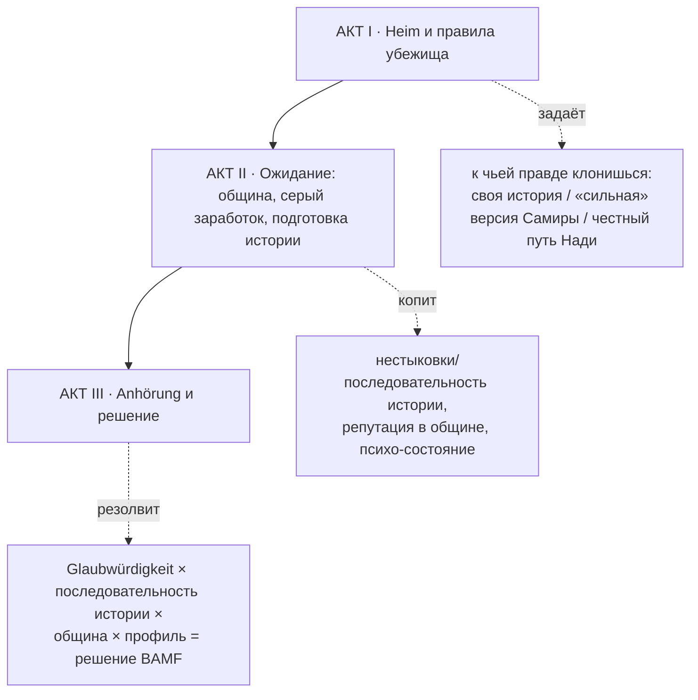
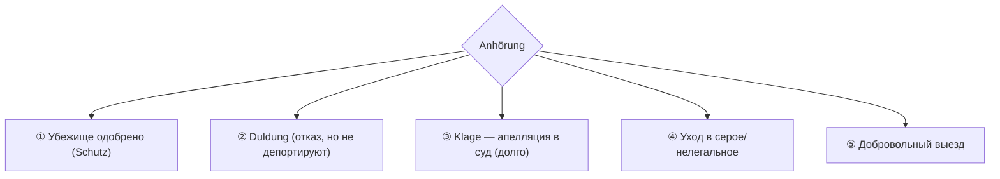

# «БЕЖЕНЕЦ» — сюжет целиком (вторая магистральная линия)

Линия-контраст к «Соискателю» (`../00_syuzhet_celikom.md`). Тот же движок сцен и формат
(`../README.md`), другая община, другой таймер, другой стержень-ось.

## Логлайн

Сириец лет тридцати — дома учитель — бежал от войны и подал на убежище в Берлине. Он живёт в
Heim, ждёт собеседования (Anhörung), и от того, **как** он расскажет свою историю, зависит,
поверят ли ему. Земляки учат «сильной» версии; правда звучит тише и слабее. Что он принесёт на
Anhörung — и кем станет, пока ждёт?

## Драматический вопрос линии

> **Какой ценой тебе поверят?**

Стержень — ось **TRUTH**. Не «врать ради выгоды у стойки», а экзистенциально: рассказать свою
настоящую, путаную, негероическую историю (риск: «недостаточно оснований») — или отрепетированную
«сильную» (риск: поймают на нестыковке, и тогда не верят уже ничему — Glaubwürdigkeit рухнет).
Побочные стержни: **PRIDE** (учитель → «номер дела»), **ALTRU** (помогать своим в Heim, когда
самому нечего), **LAW** (работать вопреки запрету/привязке к месту — Wohnsitzauflage).

## Отличия от «Соискателя» (каркас тот же)

| | Соискатель | Беженец |
|---|---|---|
| Статус | Jobseeker §20 | Aufenthaltsgestattung |
| Главный таймер | 90 дней визы (чёткий отсчёт) | путь к **Anhörung** + решение BAMF (плавает, неопределённость) |
| Стержень-ось | PRIDE | **TRUTH** |
| Старт-жильё | хостел | **Heim** (общага) |
| Деньги | 1400 € | почти нет (талоны/мин. довольствие) |
| Община | разобщённые русскоязычные | плотная арабская (Зонненаллее) |
| Кульминация | письмо LEA (N9) | **Anhörung** (N9) |
| Особое ограничение | карта/деньги из дома гаснут | Wohnsitzauflage + запрет/лимит работы первые месяцы |

## Три акта

### АКТ I — «Heim и правила» (условно дни 1–14)
Регистрация в Heim, первый контакт с системой (N1 — как ты себя предъявляешь). Узнаёшь правила:
Wohnsitzauflage (нельзя просто уехать в другой город), запрет/лимит на работу первые месяцы,
очередь к Anhörung неопределённа. Знакомства-проводники: **Валид** (сосед по Heim, циничный
старожил — камертон серого пути), **Абу Юсуф** (старейшина общины с Зонненаллее — накормит, но
ждёт лояльности), **Самира** («консультантка», учит «правильной истории»), **Надя** (немка-
волонтёрка — честный/легальный путь).

### АКТ II — «Ожидание» (дни 15–60+)
Лимб ожидания. Параллельные арки:
- **Заработок вопреки запрету** (N2): подработка на Зонненаллее/у Мехмета вчёрную (риск: ударит по делу) vs терпеть нищету vs опираться на общину.
- **Подготовка истории** (N4, ключевая): Самира репетирует с тобой «сильную» версию (добавить пыток, угроз, которых не было «в таком виде»); Надя — наоборот, помогает собрать **последовательный честный** рассказ и документы. Каждый «прогон» истории копит флаг последовательности или нестыковок.
- **Община и достоинство**: ужины, мечеть, помощь новичкам (ALTRU); цена — «быть как все», лояльность Абу Юсуфу.
- **Психика**: новости из Сирии (psycho-удар), звонки родным (ресурс и рана), ожидание выматывает.
- **Отношения** (N5): сближение с кем-то (землячка из Heim / Надя) — зеркало профиля.

### АКТ III — «Anhörung» (когда придёт повестка)
**Anhörung (N9)** — кульминационное собеседование в BAMF: офицер + переводчик. Всплывает всё
накопленное по TRUTH: последовательность твоей истории, совпадение с ранними показаниями (N1),
правдоподобие (Glaubwürdigkeit). Затем — решение.

## Узлы (адаптация N1–N9)

| Узел | Сцена | Что решает |
|---|---|---|
| **N1** | `s_heim_intake` | первый контакт с системой: как себя предъявляешь (закладка в дело) |
| **N2** | `s_first_survival` | работать вопреки запрету / терпеть / опираться на общину |
| **N4** | `s_samira_story` / `s_nadia_honest` | «сильная» версия vs честный последовательный рассказ |
| **N5** | `s_layla` | отношения-зеркало |
| **N6** | `s_work_caught` | поймали на нелегальной работе → запись в дело (мина под Anhörung) |
| **N8** | `s_newcomer_mirror` | новичок в Heim — ты в роли Валида |
| **N9** | `s_anhoerung` | **собеседование BAMF**: связка всего |

## Карта «что куда ведёт» (отложенные выстрелы)

- На N1 преувеличил/наврал → запись расходится с версией на Anhörung (N9) → **нестыковка** → Glaubwürdigkeit вниз.
- Репетировал «сильную» историю Самиры, но TRUTH низкий и нет документов → офицер ловит на деталях → отказ.
- Собрал **последовательную** историю с Надей (пусть «слабее» драматургически) → офицер верит → защита.
- Поймали на работе (N6) → запись в деле → давит на решение.
- Помогал в общине (ALTRU+) → Абу Юсуф находит тебе адвоката/переводчика к Anhörung.

## Концовки

1. **Убежище одобрено** — защита (§ от 1 до 3 лет, потом продление). Тон красит TRUTH: честная история → «тебе поверили, потому что ты не играл»; прокатившая «сильная» версия → статус есть, но внутри — заноза, что поверили не тебе настоящему.
2. **Duldung** — отказ, депортация приостановлена. Подвешенность без статуса; путь — Ausbildungsduldung (учёба/работа) или апелляция.
3. **Klage (апелляция)** — оспорить отказ в админсуде. Долгий путь, новый таймер, но шанс.
4. **Серое/нелегальное** — исчезнуть из процедуры (как «Невидимка», `../../02` §2.7). Свобода ценой вечного риска.
5. **Добровольный выезд** — уехать (в третью страну/назад). Не обязательно поражение — иногда выбор «не так».

**Эпилог-зеркало (N8):** что ты сказал новичку в Heim — добрый совет / «учи их историю, иначе не поверят» (стал Самирой) / «беги, пока не застрял» / циничный урок Валида.

## Заметки для реализации

- Линия = свой `economy.yaml`-профиль (мало денег, талоны; таймер «до Anhörung» вместо визы; флаги Wohnsitzauflage/work_ban) + свой пул событий по сценам `02_sceny.md`.
- **Glaubwürdigkeit** (правдоподобие) — счётчик, растущий от последовательности истории и совпадения с ранними показаниями; падает от пойманных нестыковок. Читается на `s_anhoerung`.
- «Сила» истории (драматургический вес) и «правда» — **разные** параметры; их конфликт и есть стержень. Высокий результат на Anhörung = последовательность + правдоподобие, а не «жесть» рассказа.
- Полные сцены — `02_sceny.md`; персонажи и диалоги — `01_personazhi.md`.
